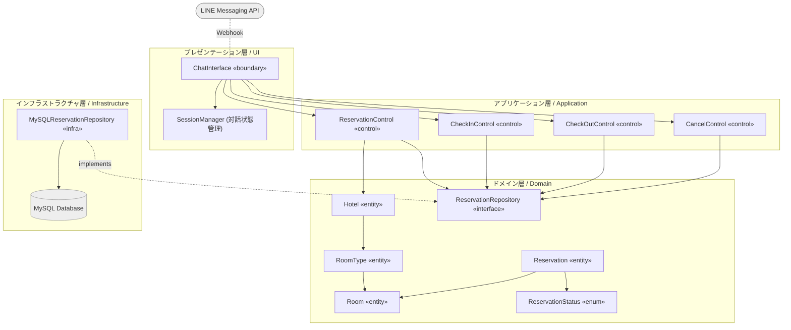
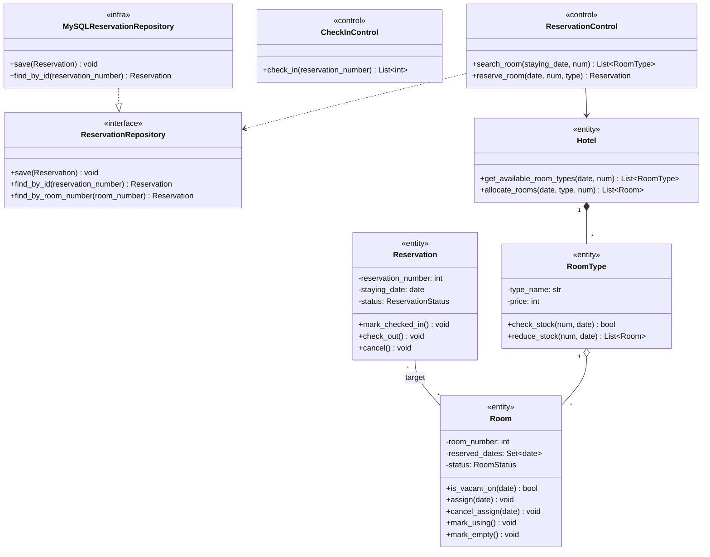
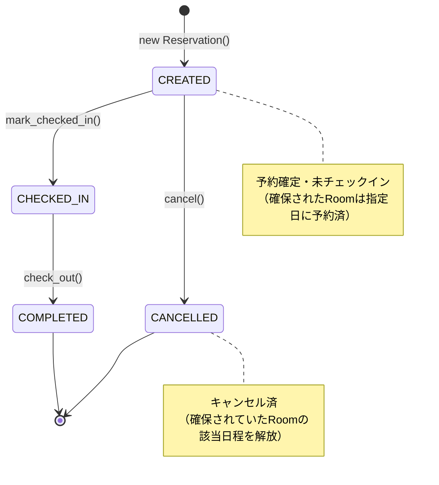

# 設計

## 方針
- ### 多層アーキテクチャと依存関係逆転の原則: 
    システムを「プレゼンテーション(UI)」「アプリケーション」「ドメイン」「インフラストラクチャ」の4層に分離する。インフラ層はドメイン層のインターフェースに依存するようにし（DIP）、ビジネスロジックがデータベースなどの技術的詳細に依存することを防ぐ。
- ### リッチドメインモデル: 
    ビジネスルール（空室判定、状態遷移）はコントロール層ではなく、ドメイン層（エンティティ）にカプセル化する。コントロール層は、適切なドメインオブジェクトに処理を委譲（メッセージパッシング）する「進行役」に徹する。
- ### 日付ベースの在庫管理: 
    連泊を想定しない1泊の予約であっても、Room 自身が「いつ予約されているか（reserved_dates）」を管理することで、同一部屋の別日の予約を許容する柔軟な在庫管理を実現する。

## パッケージ図

| パッケージ  | 役割 |
| --- | --- |
| UI層 | LINE Webhookの受付、テキストの解釈、複数ターンに及ぶ対話セッション（状態）の保持、応答の送信を行う。|
| アプリケーション層 | ユースケース（予約・チェックイン等）の手順を表現する。DBから予約を復元し、ドメインに処理を命じ、結果をDBに保存する。|
| ドメイン層 | 「部屋の空き状況の確認」「予約のキャンセルに伴う在庫解放」などのコアな業務ルールを持つ。この層は他のどの層もインポートしない。|
| インフラ層 | ドメイン層で定義された ReservationRepository の契約（インターフェース）に従い、MySQLなどのRDBに対してデータの保存・復元（SQL発行）を行う。|

## クラス図
実装（Python）の型定義と、日付ごとの在庫管理ロジックを反映した完全版クラス図。

## ステートマシン図
Reservation エンティティの status の変化を定義する。保守要件である「キャンセル」の導線を予め組み込んでおく。

- ガード条件とカプセル化
各遷移メソッドは、不正な状態からの呼び出し（例：CHECKED_IN 状態から cancel() を呼ぶなど）に対してドメイン独自の例外（BureaucraticError など）を送出することで、業務ルールの破綻を防ぐ。

## UI（LINEボット）連携とセッション管理のアーキテクチャ
チャットボットUI特有の課題として、「1つのユースケース（例：予約）を完了させるために、ユーザーと複数回のやり取り（日付の入力→人数入力→確定）が必要になる」点が挙げられる。これを解決するため、プレゼンテーション層に SessionManager（状態ステートマシン） を導入する。

| 構成要素 | 役割 |
| --- | --- |
| Webhook Handler | LINEから送信されたJSONを解析し、ユーザーIDとメッセージテキストを抽出する。 |
| SessionManager | Redisやオンメモリ辞書を用いて、{user_id: {"state": "AWAITING_DATE", "context": {}}} のような形でユーザーごとの会話進行度を管理する。 |
| Intent Router | ユーザーのテキスト（「予約したい」など）を判別し、SessionManagerのステータスを初期化し、対応するControlを呼び出す。 |

- 処理フロー例
1. ーザー「予約したい」 -> Webhookが受信。
2. Routerが意図を「予約開始」と解釈。SessionManagerの状態を AWAITING_DATE に設定。
3. ChatInterfaceが「宿泊日を入力してください」と返信。
4. ユーザー「2026/07/01」 -> Webhookが受信。
5. SessionManagerが現在の状態(AWAITING_DATE)を確認。入力値を一時保存し、状態を AWAITING_ROOM_TYPE に進め、Control層に空室照会(search_room)を依頼する。
