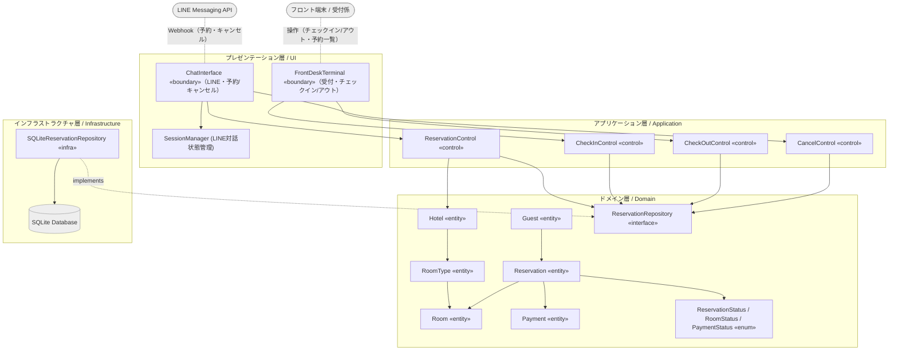
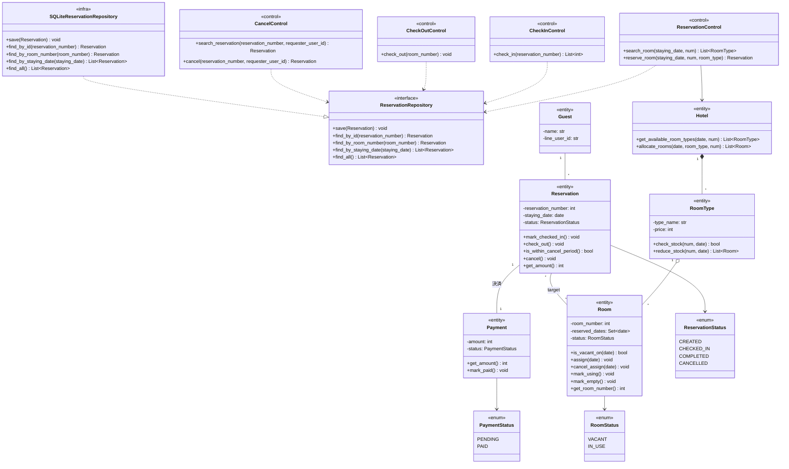
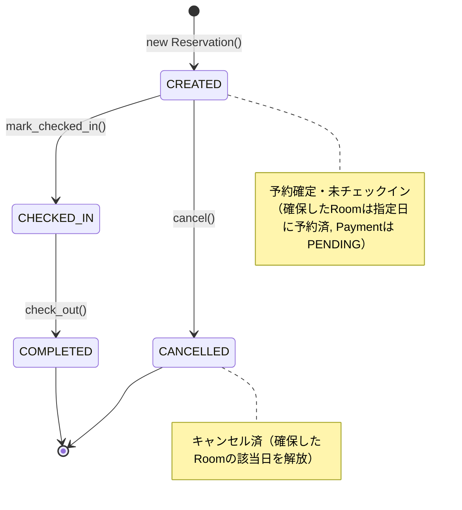

# 設計 (アーキテクチャ)

## 方針

- ### 多層アーキテクチャと依存関係逆転の原則
    システムを「プレゼンテーション (UI)」「アプリケーション」「ドメイン」「インフラストラクチャ」の4層に分離する。インフラ層はドメイン層のインタフェースに依存するようにし (DIP), ビジネスロジックがデータベース等の技術的詳細に依存することを防ぐ。
- ### リッチドメインモデル
    ビジネスルール (空室判定, 状態遷移, 一括精算) はコントロール層ではなくドメイン層 (エンティティ) にカプセル化する。コントロール層は適切なドメインオブジェクトに処理を委譲 (メッセージパッシング) する「進行役」に徹する。
- ### 日付ベースの在庫管理
    1泊の予約であっても, Room 自身が「いつ予約されているか (reserved_dates)」を管理することで, 同一部屋の別日予約を許容する柔軟な在庫を実現する。空室数・総室数は保持せず, `RoomType.check_stock(num, date)` により Room 群から導出する。
- ### 2つの UI チャネル
    予約は**利用者が LINE** で行い, チェックイン・チェックアウトは**受付係がフロント端末**で行う。両チャネルとも同一のアプリケーション層 (コントロール) を呼び出す。

## パッケージ図

| パッケージ | 役割 |
| --- | --- |
| UI層 | LINE Webhook の受付・応答, フロント端末からの受付係操作, 複数ターンに及ぶ LINE 対話セッション (状態) の保持を行う。 |
| アプリケーション層 | ユースケース (予約・チェックイン・チェックアウト・キャンセル) の手順を表現する。Repository から予約を復元し, ドメインに処理を命じ, 結果を保存する。 |
| ドメイン層 | 「空室の確認」「予約・部屋・決済の状態遷移」「一括精算」などのコア業務ルールを持つ。この層は他のどの層もインポートしない。 |
| インフラ層 | ドメイン層で定義された ReservationRepository の契約に従い, SQLite に対してデータの保存・復元 (SQL 発行) を行う。 |

## クラス図

実装 (Python) の型定義と, 日付ごとの在庫管理・一括精算を反映した完全版。

## ステートマシン図

Reservation エンティティの status の変化を定義する。CREATED → CANCELLED の導線は, アプリケーション層の `CancelControl` が担う。

> キャンセルは「予約をキャンセルする」(UC4) として実装済み。本人確認・期限・対話フローの詳細は [Cancel_Feature.md](Cancel_Feature.md) を参照。

補足:

- **Payment の状態遷移**は PENDING → PAID (チェックアウトの `check_out()` 内で `mark_paid()`)。
- **Room の状態遷移**は VACANT → IN_USE (`mark_using()`, チェックイン) → VACANT (`mark_empty()`, チェックアウト)。予約日集合 `reserved_dates` は予約時 `assign(date)`, キャンセル時 `cancel_assign(date)` で増減する。
- **ガード条件とカプセル化.** 各遷移メソッドは, 不正な状態からの呼び出し (例: CHECKED_IN から cancel() など) に対してドメイン独自の例外 (BureaucraticError 等) を送出し, 業務ルールの破綻を防ぐ。

## UI (LINEボット / フロント端末) 連携とセッション管理

チャットボット UI 特有の課題として, 「1つのユースケース (例: 予約) を完了させるために, 利用者と複数回のやり取り (日付→人数→確定) が必要になる」点がある。これを解決するため, プレゼンテーション層に SessionManager (対話状態のステートマシン) を導入する。チェックイン・チェックアウトは受付係がフロント端末で操作するため, 多ターンのセッション管理は主に LINE (予約) 側で必要となる。

| 構成要素 | 役割 |
| --- | --- |
| Webhook Handler | LINE から送信された JSON を解析し, ユーザ ID とメッセージテキストを抽出する。 |
| SessionManager | Redis やオンメモリ辞書で, `{user_id: {"state": "AWAITING_DATE", "context": {}}}` の形でユーザごとの会話進行度を管理する。 |
| Intent Router | ユーザのテキスト (「予約したい」等) を判別し, SessionManager の状態を初期化して対応する Control を呼び出す。 |
| フロント端末 UI | 受付係が予約番号・部屋番号を入力し, チェックイン/チェックアウトを実行する。SessionManager を介さず直接該当 Control を呼ぶ。 |

処理フロー例 (予約):

1. 利用者「予約したい」→ Webhook 受信。
2. Router が意図を「予約開始」と解釈。SessionManager の状態を AWAITING_DATE に設定。
3. ChatInterface が「宿泊日を入力してください」と返信。
4. 利用者「2026/07/01」→ Webhook 受信。
5. SessionManager が現在の状態 (AWAITING_DATE) を確認。入力値を一時保存し, 状態を AWAITING_ROOM_TYPE に進め, Control に空室照会 (`search_room`) を依頼する。