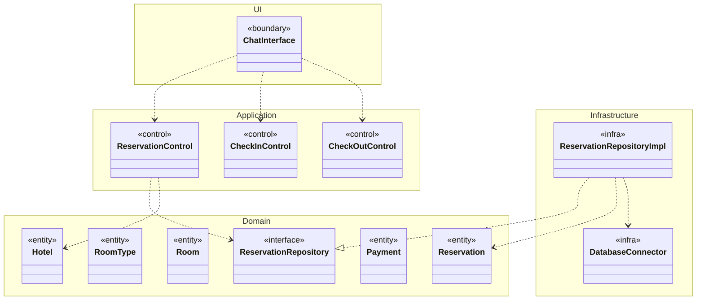
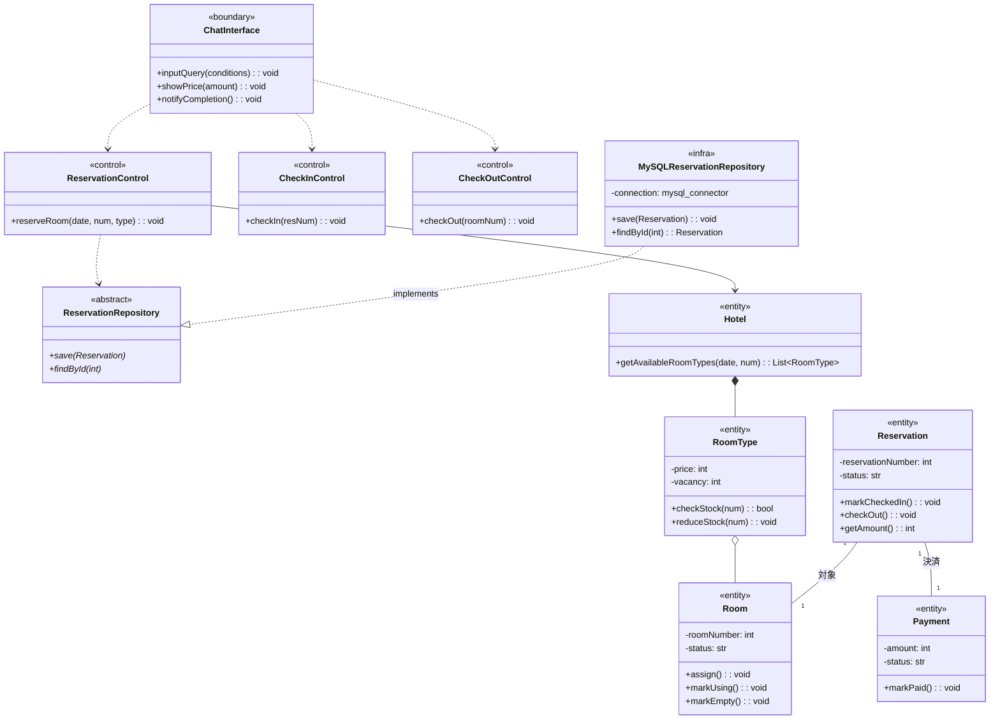

# アーキテクチャ設計

## 方針
非機能要件に対する設計方針は以下の通り。
- ### 保守性（UI変更への対応）: 
    UI層（LINEボットやテキストUI）とアプリケーション層（コントロール）を完全に分離する。これにより、UIがLINEからWeb画面やスマホアプリに変わっても、ビジネスロジックは一切変更せずに済む。
- ### 開発の容易性（独立した並行開発）: 
    各層（パッケージ）の間に「インターフェース」を設ける。これにより、例えばUI担当グループは「コントローラーのダミー（モック）」を使って開発を進め、DB担当グループは「ロジック抜きでSQLのテストだけ行う」といった独立開発が可能になる。
- ### 永続性とネットワーク（MySQL等の利用）: 
    ビジネスロジック（ドメイン層）にSQLを直接書くのではなく、インフラストラクチャ層（データアクセス層）に隔離する。

## パッケージ図

| パッケージ  | 役割 |
| --- | --- |
| UI層 | ユーザーとの対話（標準入出力やLINE API）のみを担当し、ロジックは持たずアプリケーション層を呼び出します。|
| アプリケーション層 | システム分析で定義したユースケース（コントロール）の進行を管理します。|
| ドメイン層 | システム分析で定義したエンティティ群です。ルールや状態（在庫を減らす、ステータスを変える等）を持ちます。この層は他のどの層にも依存しません。|
| インフラ層 | MySQLなどのデータベースへのアクセス（SQLの実行）をカプセル化します。

## クラス図
パッケージ間の通信をインターフェース（<<interface>>）を用いて疎結合にするためのクラス図です。
