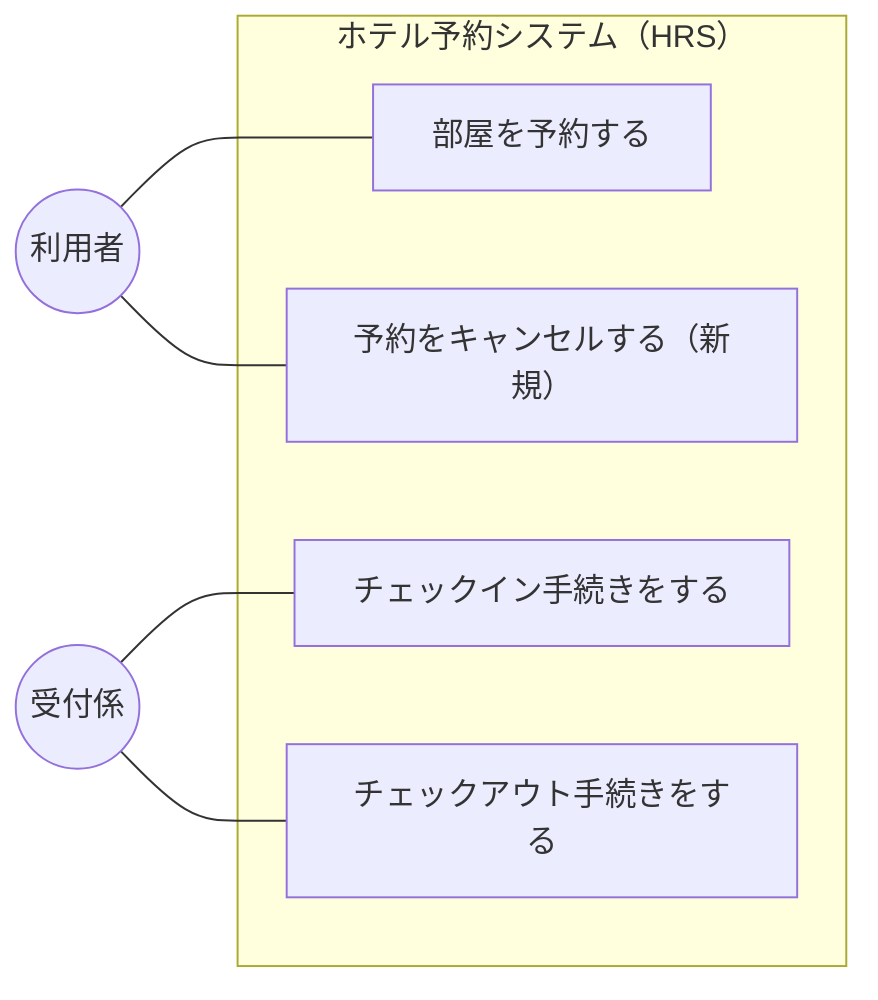
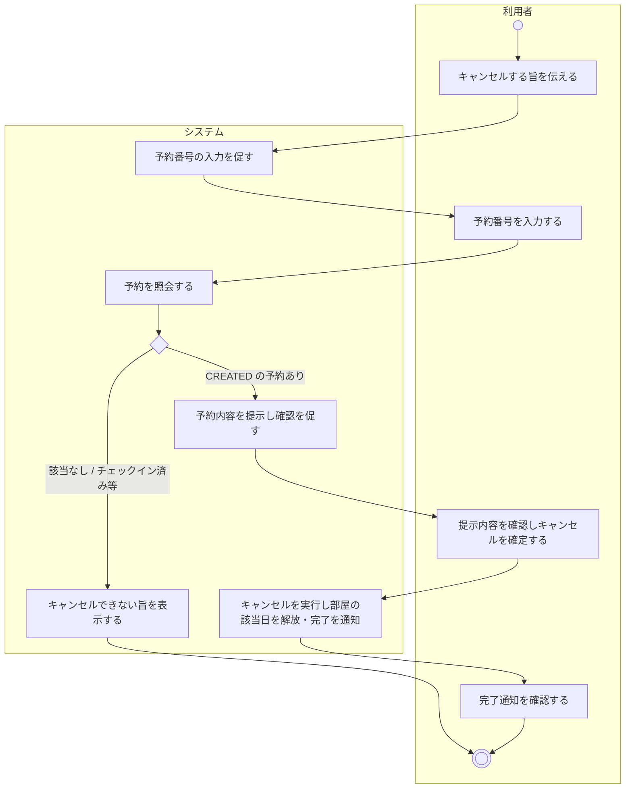
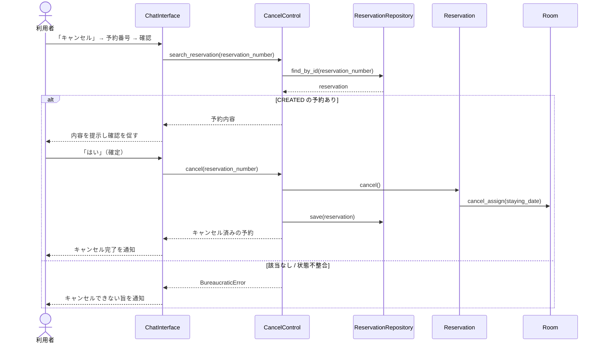
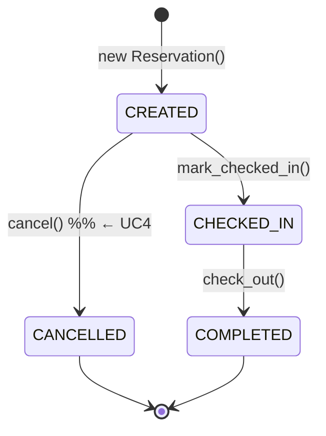

# 予約キャンセル機能 提案書

ホテル予約システム (HRS) に「予約をキャンセルする」機能を追加するための提案である。既存の分析・設計 (Requirements_Analysis.md / System_Analysis.md / Architecture.md / Design.md) に反しない形で, ユースケース・フロー・設計上の位置づけをまとめる。

本書は**提案 (合意形成用)** であり, 実装は含まない。合意後に各分析・設計ドキュメントへ反映し, 実装フェーズへ進むことを想定する。

---

## 1. 背景と現状

予約のキャンセルは, `Requirements_Analysis.md`「今後の検討事項」で「機能として加えるか (現状は対象外)」とされ, `Architecture.md` / `Design.md` では **保守拡張の受け皿**として, ドメイン層・アプリケーション層にあらかじめ組み込まれている。

### 実装済み (バックエンドは完成)

| レイヤ | 実装 | 内容 |
| --- | --- | --- |
| ドメイン | `Reservation.cancel()` | `CREATED → CANCELLED` の状態遷移。確保していた部屋の該当日を `Room.cancel_assign()` で解放。不正な状態 (チェックイン済み・完了済み) からは `BureaucraticError` を送出。 |
| ドメイン | `ReservationStatus.CANCELLED` / `Room.cancel_assign()` | 状態・解放操作。 |
| アプリケーション | `CancelControl` | `search_reservation()` (照会) / `cancel()` (該当なしガード → 委譲 → 保存)。 |
| インフラ | `SQLiteReservationRepository` | `save()` が `CANCELLED` を永続化。`find_by_staying_date()` はキャンセルを除外するため, キャンセルで在庫が自動的に戻る (DB引き)。 |
| テスト | `test_domain_models.py` / `test_db_availability.py` | 状態遷移ガード, キャンセルによる在庫解放を検証済み。 |

### 未実装 (本提案の対象)

- **UI 導線が存在しない。** LINE (`ChatInterface`), フロントデスク Web, `main.py` のいずれからも `CancelControl` は呼ばれていない。利用者・受付係がキャンセルを実行する入口がない。

> 注: `ChatInterface` の「キャンセル」キーワードは**予約対話の中断 (リセット)** 用であり, 既存予約のキャンセルとは別物である。

---

## 2. スコープと前提

- **アクタ**: 利用者 (LINE)。予約を行った本人が, LINE 上で自分の予約をセルフキャンセルする。
- **対象**: **未チェックイン (`CREATED`) の予約のみ**。チェックイン済み・完了済みはキャンセル不可 (ドメインのガードに準拠)。
- **識別**: 予約番号で対象予約を特定する。
- **在庫**: キャンセルにより, 確保していた部屋・宿泊日が解放され, 再度予約可能になる (既存の DB引きで自動反映)。
- **スコープ外 (今回は扱わない)**: キャンセル料・返金処理, キャンセル期限 (例: 前日まで), 予約内容の変更 (日付・部屋の変更)。→ 第7章に検討事項として記載。

---

## 3. ユースケース図

既存の UC1〜UC3 に, 新規 **UC4「予約をキャンセルする」(アクタ: 利用者)** を追加する。

注記:
- UC4 は UC2 (チェックイン) の**前**にのみ実行できる (対象は `CREATED` の予約)。事前条件として表す。
- 予約 (UC1) と同じく利用者が LINE で行う。LINE API はインタフェースであり, ユースケース図には含めない。

---

## 4. ユースケース記述

### UC4. 予約をキャンセルする

| 項目 | 内容 |
| --- | --- |
| ユースケース | 予約をキャンセルする |
| アクタ | 利用者 |
| 目的 | 利用者が, チェックイン前の自分の予約を取り消す |
| 事前条件 | 対象の予約が存在し, ステータスが「予約済み (CREATED)」である |
| 事後条件 | 予約のステータスが「キャンセル済み (CANCELLED)」に更新され, 確保していた部屋・宿泊日が解放されている |

**基本系列**

1. 利用者は, システムに予約をキャンセルする旨を伝える。
2. システムは, 予約番号の入力を促す。
3. 利用者は, 予約番号を入力する。
4. システムは, 予約内容 (宿泊日・部屋タイプ・料金・状態) を提示し, キャンセルの確認を促す。
5. 利用者は, キャンセルを確定する。
6. システムは, 予約をキャンセル済みに更新し, 確保していた部屋の該当日を解放する。
7. システムは, キャンセル完了を利用者に通知する。

**代替系列**

- 基本系列4: 該当する予約がない場合は, 警告を表示して終了する。
- 基本系列4: 予約がすでにチェックイン済み・完了済み・キャンセル済みの場合は, キャンセルできない旨を表示して終了する。
- 基本系列5: 利用者が確定しなかった (「はい」以外) 場合は, キャンセルを行わずに終了する。

**備考**

- キャンセルは宿泊日 (チェックイン) の前に行う。チェックイン後は対象外。

**シナリオ**

- 早稲田太郎は, 予約番号 123456 の予約をキャンセルしたいと考え, LINE でシステムにキャンセルを申し出た。システムは予約内容 (2026-07-01 / Standard 1室 / 10000円) を提示し, 太郎が確認すると, 予約をキャンセル済みにして完了を通知した。確保されていた部屋はその日について空室に戻った。

---

## 5. アクティビティ図

---

## 6. 相互作用 (コミュニケーション図)

キャンセル確定時の, 設計レベルのクラス間の相互作用。既存の `CancelControl` と `Reservation.cancel()` を再利用する。

補足: コントロールは予約を照会し (`find_by_id`), キャンセルは予約オブジェクトへ委譲する (`Reservation.cancel()`)。予約は自身の関連する `Room` の該当日を解放する (`cancel_assign`)。在庫は DB引きで判定されるため, キャンセル後は自動的に空室として扱われる。

---

## 7. 状態遷移 (再掲・キャンセル可能条件)

既存のステートマシン (Architecture.md / Design.md) のとおり, キャンセルは `CREATED` からのみ可能である。本提案は新たな状態を追加しない。

- キャンセル可能: `status == CREATED` のみ。
- キャンセル不可: `CHECKED_IN` / `COMPLETED` / `CANCELLED` → `BureaucraticError`。

---

## 8. 既存設計との整合

本提案は「保守拡張の受け皿」として用意済みのバックエンドをそのまま活用する。**新規に追加が必要なのはプレゼンテーション層 (LINE の対話) のみ**である。

| 要素 | 追加/再利用 | 内容 |
| --- | --- | --- |
| `Reservation.cancel()` | 再利用 | 実装済み。変更不要。 |
| `CancelControl` | 再利用 | 実装済み。変更不要。 |
| リポジトリ | 再利用 | `find_by_id` / `save` を使用。契約変更なし。 |
| `SessionManager` / `SessionState` | 追加 | キャンセル対話用の状態 (例: `CANCEL_AWAITING_RES_NUM`, `CANCEL_AWAITING_CONFIRM`) を追加。 |
| `ChatInterface` | 追加 | 初期状態でのキャンセル受付 (例: 「キャンセル」/「予約キャンセル」)。予約番号の受け取り, 内容提示, 確定 → `CancelControl` 呼び出し。 |

> 補足: 初期状態 (`INIT`) では現在「キャンセル」キーワードは中断リセットに使われていない (中断リセットは対話の途中でのみ作用する) ため, 初期状態での「キャンセル」をキャンセル機能の入口に割り当てても既存挙動と衝突しない。入口キーワードは実装時に確定する。

---

## 9. 実装時に更新が必要なドキュメント

合意後, 次のドキュメントへ UC4 を反映する (本提案では未変更)。

- `Requirements_Analysis.md`: ユースケース図に UC4 を追加, ユースケース記述を追加, 「今後の検討事項」から「キャンセル」を除く。
- `System_Analysis.md`: ロバストネス分析・コミュニケーション図に UC4 を追加。
- `Architecture.md` / `Design.md`: `CancelControl` を「保守拡張の受け皿」から「実装済み機能」に格上げ, シーケンス図を追加。
- `.code/UIdesign.md`: LINE (ユーザー側) にキャンセルの対話フローを追記。

---

## 10. 今後の検討事項・リスク

1. **本人確認 (重要)**: 現状, 予約は LINE ユーザ識別子と紐づけて保存していないため, 予約番号を知っていれば第三者でもキャンセルできてしまう。セルフキャンセルを安全にするには, **予約時に LINE の userId を保存し, キャンセルは本人の予約に限定する**設計が望ましい。→ 併せて検討を推奨。
2. **キャンセル料・返金**: 現状 `Payment` は `PENDING` のままで, 返金・課金処理はない。キャンセルポリシー (無料キャンセル期限等) を設けるかは別途決定。
3. **キャンセル期限**: 「宿泊日の前日まで」等の制限を設けるか。設ける場合はドメインにガードを追加する。
4. **受付係チャネル**: 電話依頼・No-show 対応のため, 受付係がフロントデスク Web からキャンセルする導線を将来的に追加する余地がある (同じ `CancelControl` を再利用可能)。本提案では利用者 (LINE) を対象とする。

---

## 11. まとめ

- キャンセル機能はバックエンド (ドメイン・アプリ・永続化・テスト) が完成済みで, **不足しているのは LINE の対話導線のみ**である。
- 本提案では, **利用者が LINE で未チェックインの予約をセルフキャンセルする** UC4 を追加する。既存設計 (状態遷移・`CancelControl`・DB引き在庫) と矛盾しない。
- 合意後の実装は, `SessionManager` へのキャンセル用状態追加と `ChatInterface` の対話追加が中心となり, 小さく収まる見込みである。
- **本人確認の設計 (予約と LINE userId の紐づけ)** を併せて検討することを推奨する。
