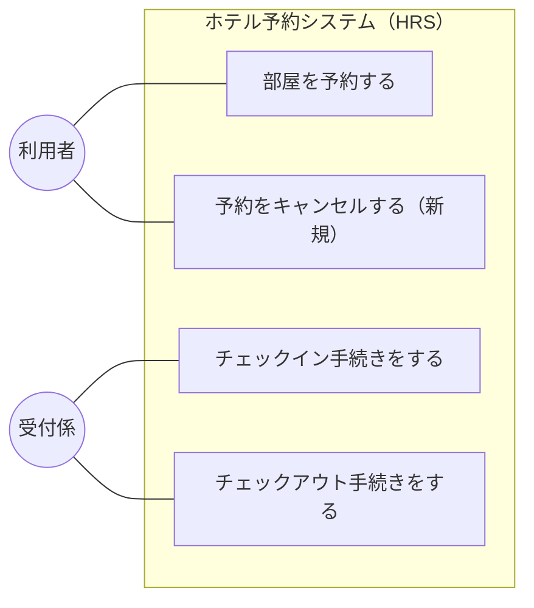
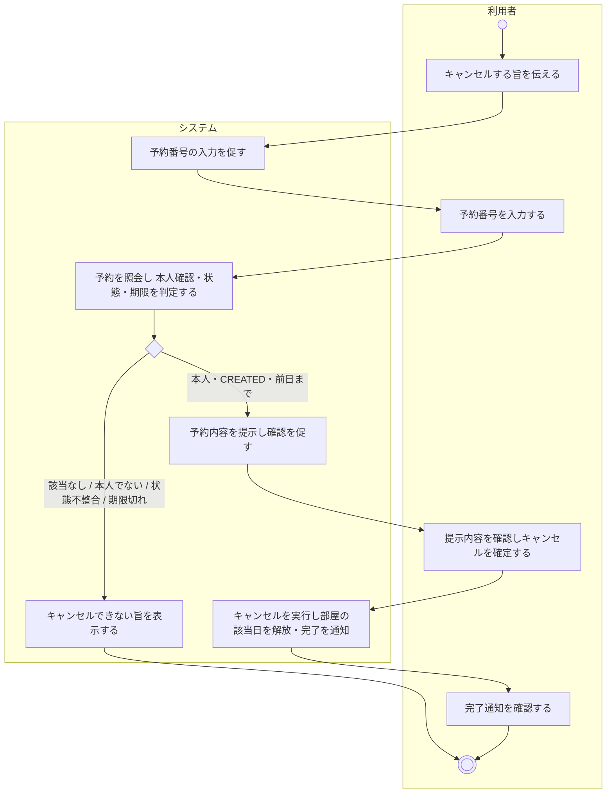
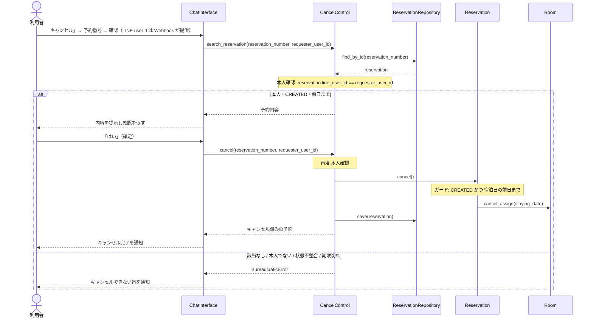
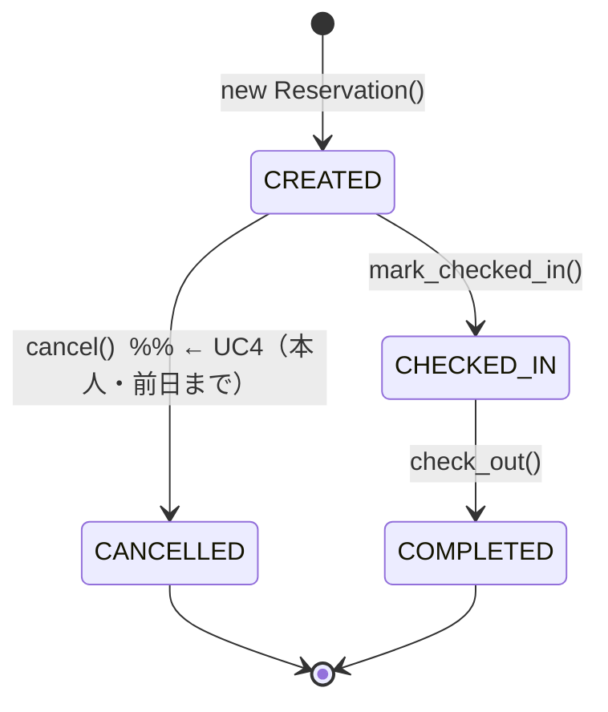

# 予約キャンセル機能 提案書

ホテル予約システム (HRS) に「予約をキャンセルする」機能を追加するための提案である。既存の分析・設計 (Requirements_Analysis.md / System_Analysis.md / Architecture.md / Design.md) に反しない形で, ユースケース・フロー・設計上の位置づけをまとめる。

本書は**提案 (合意形成用)** であり, 実装は含まない。合意後に各分析・設計ドキュメントへ反映し, 実装フェーズへ進むことを想定する。

---

## 1. 背景と現状

予約のキャンセルは, `Requirements_Analysis.md`「今後の検討事項」で「機能として加えるか (現状は対象外)」とされ, `Architecture.md` / `Design.md` では **保守拡張の受け皿**として, ドメイン層・アプリケーション層にあらかじめ組み込まれている。

### 実装済み (バックエンドの中核は完成)

| レイヤ | 実装 | 内容 |
| --- | --- | --- |
| ドメイン | `Reservation.cancel()` | `CREATED → CANCELLED` の状態遷移。確保していた部屋の該当日を `Room.cancel_assign()` で解放。不正な状態 (チェックイン済み・完了済み) からは `BureaucraticError` を送出。 |
| ドメイン | `ReservationStatus.CANCELLED` / `Room.cancel_assign()` | 状態・解放操作。 |
| アプリケーション | `CancelControl` | `search_reservation()` (照会) / `cancel()` (該当なしガード → 委譲 → 保存)。 |
| インフラ | `SQLiteReservationRepository` | `save()` が `CANCELLED` を永続化。`find_by_staying_date()` はキャンセルを除外するため, キャンセルで在庫が自動的に戻る (DB引き)。 |
| テスト | `test_domain_models.py` / `test_db_availability.py` | 状態遷移ガード, キャンセルによる在庫解放を検証済み。 |

### 未実装 (本提案の対象)

- **UI 導線が存在しない。** LINE (`ChatInterface`), フロントデスク Web, `main.py` のいずれからも `CancelControl` は呼ばれていない。利用者がキャンセルを実行する入口がない。
- **本人確認の仕組みがない。** 予約は LINE の利用者識別子と紐づけて保存していないため, 現状のままでは予約番号を知る第三者もキャンセルできてしまう。→ 本提案で対応する。

> 注: `ChatInterface` の「キャンセル」キーワードは**予約対話の中断 (リセット)** 用であり, 既存予約のキャンセルとは別物である。

---

## 2. スコープと前提

- **アクタ**: 利用者本人 (LINE)。予約を行った本人が, LINE 上で自分の予約をセルフキャンセルする。
- **本人確認 (対象に含む)**: 予約時に **予約者の LINE userId を保存**し, キャンセルは **要求者の userId が予約者と一致する場合のみ**許可する。予約番号は対象の特定に用い, 認可は userId の一致で行う。
- **既存予約の扱い (対象に含む)**: `line_user_id` 導入前の予約は所有者を安全に特定できないため, LINE セルフキャンセルの対象外とする。既存予約のキャンセル依頼はシステム外の運用で受け付け, 将来の受付係向けキャンセル導線で対応する。新規予約から `line_user_id` を必須保存する。
- **対象**: 未チェックイン (`CREATED`) の予約のみ。チェックイン済み・完了済み・キャンセル済みは不可。
- **キャンセル期限 (対象に含む)**: **チェックイン (宿泊日) の前日まで**キャンセル可能とする。宿泊日当日以降は不可。
- **在庫**: キャンセルにより, 確保していた部屋・宿泊日が解放され, 再度予約可能になる (既存の DB引きで自動反映)。
- **スコープ外 (今回は扱わない)**: キャンセル料・返金処理, 予約内容の変更 (日付・部屋の変更), 受付係によるキャンセル代行。→ 第10章に記載。

### 本人確認が成立する根拠

LINE の Webhook イベントには送信者の `userId` (`event.source.user_id`) が含まれる。Webhook は `X-Line-Signature` を Channel secret で署名検証しているため, この userId は利用者が詐称できない (改ざん要求は署名検証で弾かれる)。したがって「予約者の userId」と「キャンセル要求者の userId」を突き合わせることで, **予約者本人のみがキャンセルできる**ことを保証できる。

---

## 3. ユースケース図

既存の UC1〜UC3 に, 新規 **UC4「予約をキャンセルする」(アクタ: 利用者)** を追加する。

注記:
- UC4 は UC2 (チェックイン) の**前日まで**にのみ実行できる (対象は `CREATED` の予約, かつ宿泊日の前日まで)。事前条件として表す。
- 予約 (UC1) と同じく利用者本人が LINE で行う。LINE API はインタフェースであり, ユースケース図には含めない。

---

## 4. ユースケース記述

### UC4. 予約をキャンセルする

| 項目 | 内容 |
| --- | --- |
| ユースケース | 予約をキャンセルする |
| アクタ | 利用者 (予約者本人) |
| 目的 | 利用者が, チェックイン前日までに, 自分の予約を取り消す |
| 事前条件 | 対象の予約が存在し, ステータスが「予約済み (CREATED)」であり, 要求者が予約者本人であり, 本日が宿泊日の前日以前である |
| 事後条件 | 予約のステータスが「キャンセル済み (CANCELLED)」に更新され, 確保していた部屋・宿泊日が解放されている |

**基本系列**

1. 利用者は, システムに予約をキャンセルする旨を伝える。
2. システムは, 予約番号の入力を促す。
3. 利用者は, 予約番号を入力する。
4. システムは, 予約が要求者本人のものであることを確認し, 予約内容 (宿泊日・部屋タイプ・料金・状態) を提示して, キャンセルの確認を促す。
5. 利用者は, キャンセルを確定する。
6. システムは, 予約をキャンセル済みに更新し, 確保していた部屋の該当日を解放する。
7. システムは, キャンセル完了を利用者に通知する。

**代替系列**

- 基本系列4: 該当する予約がない場合, 予約が**要求者本人のものでない**場合, または既存予約で所有者を確認できない場合は, 予約の存在を第三者へ推測させない共通メッセージ「予約を確認できないか、キャンセルできません」を表示して終了する。詳細理由は利用者へ返さず, 内部ログにのみ記録する。
- 基本系列4: 予約がすでにチェックイン済み・完了済み・キャンセル済みの場合は, キャンセルできない旨を表示して終了する。
- 基本系列4: **本日が宿泊日当日以降**の場合は, キャンセル期限を過ぎている旨を表示して終了する。
- 基本系列5: 利用者が確定しなかった (「はい」以外) 場合は, キャンセルを行わずに終了する。

**備考**

- キャンセルは宿泊日 (チェックイン) の**前日まで**行える。宿泊日当日以降・チェックイン後は対象外。

**シナリオ**

- 早稲田太郎は, 2026-07-10 に宿泊予定の予約 (番号 123456) を, 前々日の 7月8日にキャンセルしたいと考え, LINE でシステムにキャンセルを申し出た。システムは, 太郎が予約者本人であることを確認したうえで予約内容を提示し, 太郎が確認するとキャンセル済みにして完了を通知した。確保されていた部屋は 7月10日について空室に戻った。

---

## 5. アクティビティ図

---

## 6. 相互作用 (コミュニケーション図)

キャンセル確定時の, 設計レベルのクラス間の相互作用。本人確認 (userId 照合) はコントロールが, 状態・期限のガードはドメインが担う。

補足: コントロールは予約を照会し (`find_by_id`), 要求者の userId が予約者と一致することを確認したうえで, キャンセルを予約オブジェクトへ委譲する (`Reservation.cancel()`)。予約は状態と期限を検査し, 自身の関連する `Room` の該当日を解放する (`cancel_assign`)。在庫は DB引きで判定されるため, キャンセル後は自動的に空室として扱われる。

---

## 7. 状態遷移 (再掲・キャンセル可能条件)

既存のステートマシン (Architecture.md / Design.md) のとおり, キャンセルは `CREATED` からのみ可能である。本提案は新たな状態を追加しない。既存の `Reservation.cancel()` に**キャンセル期限のガードを追加**する。

- キャンセル可能: `status == CREATED` かつ `本日 < 宿泊日` (= 前日まで) かつ 要求者が本人。
- キャンセル不可: `CHECKED_IN` / `COMPLETED` / `CANCELLED`, または `本日 >= 宿泊日` (期限切れ), または本人でない → `BureaucraticError`。

---

## 8. 既存設計との整合と, 追加が必要な実装

本提案は「保守拡張の受け皿」として用意済みのバックエンドを最大限活用する。本人確認と期限のために, 予約に**予約者の LINE userId** を持たせる小さな拡張を加える。

| 要素 | 追加/変更 | 内容 |
| --- | --- | --- |
| `Reservation.cancel()` | 変更 | 既存の状態ガードに加え, **キャンセル期限のガード** (`本日 < 宿泊日`) を追加。期限切れは `BureaucraticError`。 |
| `Reservation` / `Guest` | 変更 | 予約者の **`line_user_id`** を保持する (予約時に設定)。 |
| リポジトリ (契約・SQLite・スキーマ) | 変更 | `reservations` テーブルに nullable な `line_user_id` 列をマイグレーションで追加し, 保存・復元する。既存行は `NULL` のまま保持し, セルフキャンセル対象外とする。新規予約ではアプリケーション層で必須入力として保存する。契約の検索メソッドは変更なし。 |
| `ReservationControl.reserve_rooms()` | 変更 | 予約時に `line_user_id` を受け取り, 予約に保存する。 |
| `CancelControl` | 変更 | `search_reservation` / `cancel` に要求者の userId を渡し, **本人確認 (userId 一致)** を行う。該当なし・不一致・`line_user_id` 未設定は内部では区別して記録するが, UI には予約の存在を推測できない共通エラーを返す。 |
| `SessionManager` / `SessionState` | 追加 | キャンセル対話用の状態 (例: `CANCEL_AWAITING_RES_NUM`, `CANCEL_AWAITING_CONFIRM`) を追加。 |
| `ChatInterface` | 追加 | 初期状態でのキャンセル受付。予約番号の受け取り, 本人確認つきの照会, 内容提示, 確定 → `CancelControl` 呼び出し。予約時・キャンセル時とも `event.source.user_id` を渡す。 |
| テスト | 追加 | 本人確認 (他人の予約は不可), 期限 (当日以降は不可), 正常系のキャンセル, 既存DBへの列追加, `line_user_id` 未設定予約の拒否, 該当なしと本人不一致で外部応答が同一になることを検証。 |

### 既存 SQLite DB の移行方針

`CREATE TABLE IF NOT EXISTS` だけでは既存の `reservations` テーブルへ列を追加できないため, 起動時のスキーマ初期化で `PRAGMA table_info(reservations)` を確認し, `line_user_id` がなければ `ALTER TABLE reservations ADD COLUMN line_user_id TEXT NULL` を一度だけ実行する。既存データを推測で特定の LINE アカウントへ紐づけてはならない。

照会時は「予約の取得 → userId の存在・一致確認 → 状態・期限確認 → 詳細表示」の順で検証し, 本人確認が完了する前に予約の状態や期限を外部応答へ含めない。

- 既存行: `line_user_id IS NULL`。LINE セルフキャンセル不可。
- 新規行: 予約時の署名検証済み userId を必須保存。
- 移行失敗時: トランザクションをロールバックして起動を失敗させ, 一部だけ移行された状態でサービスを継続しない。
- ログ: 予約番号や userId の全文を通常ログへ出さず, 必要に応じてマスキングする。

> 補足: 初期状態 (`INIT`) では現在「キャンセル」キーワードは中断リセットに使われていない (中断リセットは対話の途中でのみ作用する) ため, 初期状態での「キャンセル」をキャンセル機能の入口に割り当てても既存挙動と衝突しない。入口キーワードは実装時に確定する。

---

## 9. 実装時に更新が必要なドキュメント

合意後, 次のドキュメントへ UC4 を反映する (本提案では未変更)。

- `Requirements_Analysis.md`: ユースケース図に UC4 を追加, ユースケース記述を追加, 「今後の検討事項」から「キャンセル」を除く。前提に「本人確認 (LINE userId)」「キャンセル期限 (前日まで)」を追記。
- `Domain_Analysis.md`: `Guest` (または `Reservation`) に予約者の LINE 識別子を持つことを反映。
- `System_Analysis.md`: ロバストネス分析・コミュニケーション図に UC4 を追加。
- `Architecture.md` / `Design.md`: `CancelControl` を「保守拡張の受け皿」から「実装済み機能」に格上げ, 本人確認・期限ガードとシーケンス図を追加。
- `.code/UIdesign.md`: LINE (ユーザー側) にキャンセルの対話フローを追記。

---

## 10. 今後の検討事項・リスク

1. **キャンセル料・返金**: 現状 `Payment` は `PENDING` のままで, 返金・課金処理はない。無料キャンセルを前提とするか, キャンセルポリシーを設けるかは別途決定。
2. **受付係チャネル**: 電話依頼・No-show 対応のため, 受付係がフロントデスク Web からキャンセルする導線を将来的に追加する余地がある (同じ `CancelControl` を再利用可能。ただし本人確認は受付係が代行する形になる)。本提案では利用者 (LINE) を対象とする。
3. **userId の前提**: `userId` は「このボット × この利用者」で安定した匿名 ID である。利用者が別の LINE アカウントに変更した場合, 本人の予約にアクセスできなくなる。実務上の許容範囲として扱う。

---

## 11. まとめ

- キャンセル機能の中核 (ドメイン・アプリ・永続化・テスト) は完成済みで, 不足しているのは **LINE の対話導線**と, セルフキャンセルを安全にする**本人確認・期限**である。
- 本提案では, **利用者が LINE で, 未チェックインかつ宿泊日の前日までの自分の予約を, 本人確認のうえセルフキャンセルする** UC4 を追加する。既存設計 (状態遷移・`CancelControl`・DB引き在庫) と矛盾しない。
- 追加実装は, 予約への `line_user_id` の保持 (小さなスキーマ拡張), `Reservation.cancel()` への期限ガード, `CancelControl` での本人確認, `SessionManager`/`ChatInterface` のキャンセル対話が中心となる。
