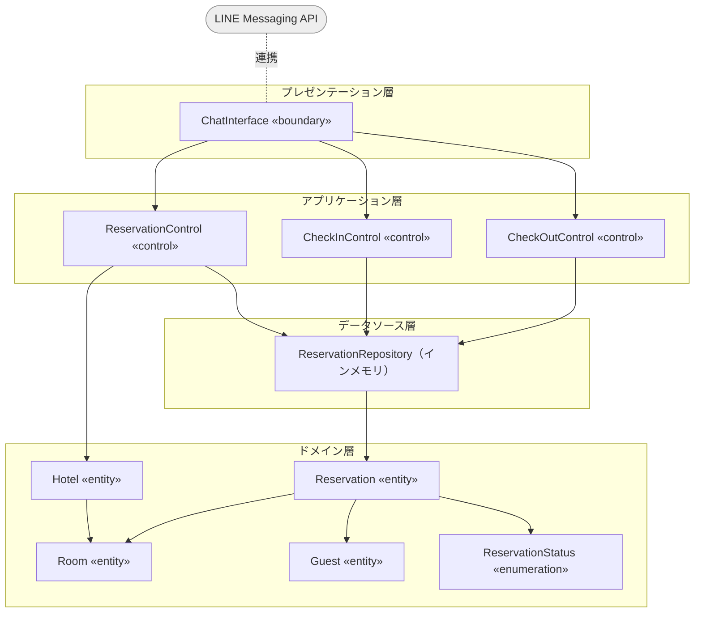
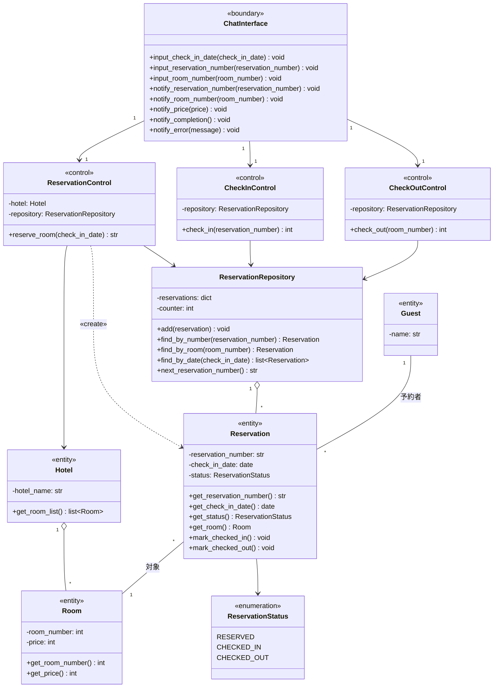
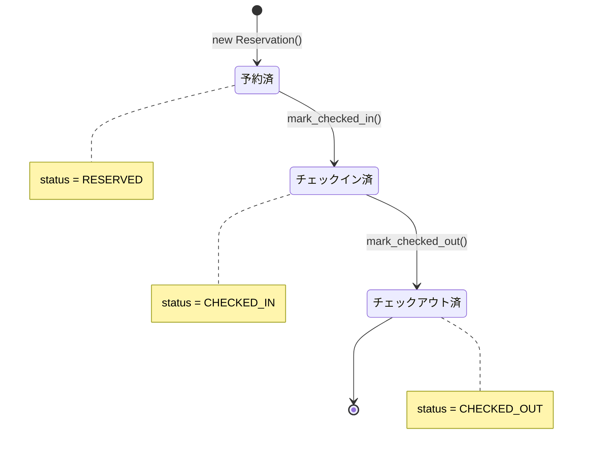
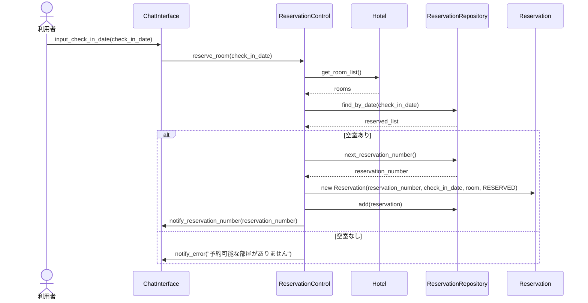
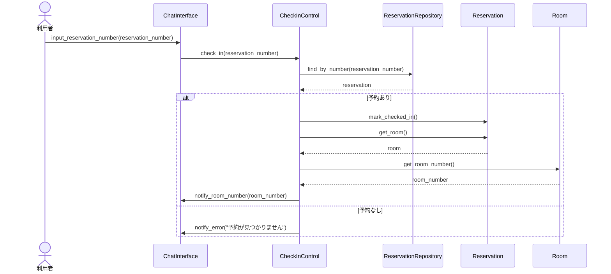
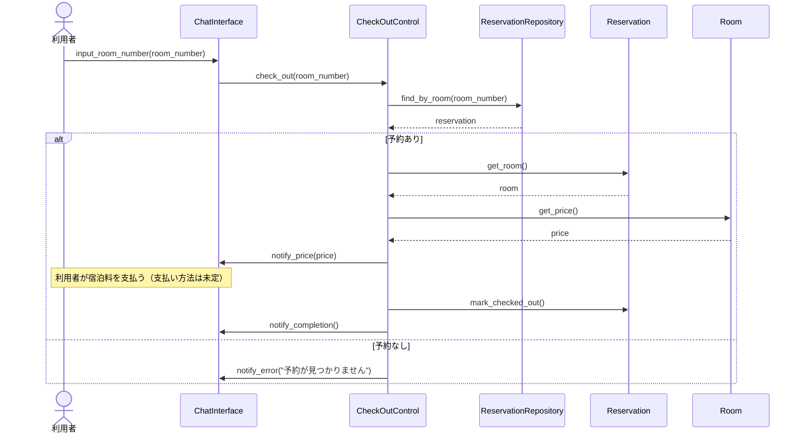

# 設計

ホテル予約システム (HRS) の設計の成果物をまとめた。本システムは, LINE Messaging API を用いて, ホテルの予約・チェックイン・チェックアウトを行うチャットボット型システムであり, 実装言語は Python とする。

設計は, 分析モデル (システム分析の成果物) をもとに, 実装方法を加味して, 基本設計 (アーキテクチャ設計) と詳細設計 (型付き設計クラス図・ステートマシン図・シーケンス図) を行う。

## 設計上の決定事項

- データの永続化: インメモリ (Python の辞書/リスト) で保持し, `ReservationRepository` で抽象化する。将来 DB へ差し替え可能とする。
- 予約の状態 `status`: `ReservationStatus` 列挙型 (`RESERVED` / `CHECKED_IN` / `CHECKED_OUT`) で表し, `mark_checked_in()` / `mark_checked_out()` で遷移する。
- 予約番号 `reservation_number`: 連番6桁の文字列 (`000001` から) とする。
- 命名規約: クラスは PascalCase, メソッド・属性は Python 慣習の snake_case とする。

---

# 1. 基本設計

## 1.1 アーキテクチャ設計 (多層アーキテクチャ)

変更容易性 (特にユーザインタフェースの変更への強さ) を重視し, 多層アーキテクチャ (Layers パターン) を採用する。分析のロバストネス分析で識別したバウンダリ・コントロール・エンティティを, 次の各層に割り当てる。

各層の責務は次のとおりである。

| 層 | クラス | 責務 |
| --- | --- | --- |
| プレゼンテーション層 | ChatInterface | LINE Messaging API との連携。利用者の入力 (テキスト) の受け取りと, 応答メッセージの送信。 |
| アプリケーション層 | ReservationControl, CheckInControl, CheckOutControl | 各ユースケースの制御ロジック。ドメイン層・データソース層を協調させる。 |
| ドメイン層 | Hotel, Reservation, Room, Guest, ReservationStatus | 業務の中核データとロジック。 |
| データソース層 | ReservationRepository | 予約の保持・検索を抽象化 (今回はインメモリ実装)。 |

依存の方向は上位層から下位層への一方向とし, 下位層は上位層を知らない。LINE Messaging API は外部システムであり, プレゼンテーション層 (ChatInterface) のみが連携する。

## 1.2 設計順序 (Inside-Out 原則)

変更されにくい (安定した) 中心から外側へ向かって設計・実装する。一般的な順序は, エンティティ → データソース → コントロール → バウンダリ である。本システムでは次の順で設計する。

1. ドメイン層のエンティティ (Room, Reservation, ReservationStatus, Hotel, Guest)
2. データソース層 (ReservationRepository)
3. アプリケーション層のコントロール (ReservationControl, CheckInControl, CheckOutControl)
4. プレゼンテーション層 (ChatInterface)

## 1.3 適用する設計原則・パターン

| 原則・パターン | 適用箇所 | ねらい |
| --- | --- | --- |
| Layers (多層アーキテクチャ) | 全体 | 関心の分離。UI (チャット) の変更を局所化する。 |
| Repository パターン | ReservationRepository | 永続化方式の隠蔽。インメモリ ↔ DB の差し替えを容易にする。 |
| 依存関係逆転の原則 (DIP) | コントロール → Repository | コントロールは永続化の詳細に依存しない。 |
| 単一責任の原則 (SRP) | 各コントロール | 1ユースケース1コントロール。 |
| 高凝集・低結合 | 全体 | 各クラスの責務を明確化し, 結合を最小化する。 |
| 列挙型による状態表現 | ReservationStatus | 状態の取り違えを防ぐ。 |
| (拡張) Strategy パターン | 支払い方法 (未実装) | チャット決済・現地払いなどの差し替えに備える。 |

---

# 2. 詳細設計

## 2.1 名前対応表 (分析レベル → 設計レベル)

分析レベルの名前を, Python 実装に即した名前・型へ変換する。

### クラス

| 分析レベル | 設計レベル (Python) | 種別 |
| --- | --- | --- |
| Chat_Interface | ChatInterface | バウンダリ |
| Reservation_Control | ReservationControl | コントロール |
| CheckIn_Control | CheckInControl | コントロール |
| CheckOut_Control | CheckOutControl | コントロール |
| Guest | Guest | エンティティ |
| Reservation | Reservation | エンティティ |
| Room | Room | エンティティ |
| Hotel | Hotel | エンティティ |
| (新規) | ReservationStatus | 列挙型 |
| (新規・分析の予約保管庫に相当) | ReservationRepository | データソース |

### 属性 (型付き)

| クラス | 設計レベル属性 | 型 |
| --- | --- | --- |
| Guest | name | str |
| Reservation | reservation_number | str |
| Reservation | check_in_date | date |
| Reservation | status | ReservationStatus |
| Room | room_number | int |
| Room | price | int |
| Hotel | hotel_name | str |

### メソッド (分析の操作 → 設計のメソッド)

| 分析レベル操作 | 設計レベルメソッド | 備考 |
| --- | --- | --- |
| ChatInterface.inputCheckInDate() | input_check_in_date(check_in_date: date) | 利用者入力の受け取り |
| ChatInterface.inputReservationNumber() | input_reservation_number(reservation_number: str) | |
| ChatInterface.inputRoomNumber() | input_room_number(room_number: int) | |
| ChatInterface.notifyReservationNumber() | notify_reservation_number(reservation_number: str) | 応答送信 |
| ChatInterface.notifyRoomNumber() | notify_room_number(room_number: int) | |
| ChatInterface.notifyPrice() | notify_price(price: int) | |
| ChatInterface.notifyCompletion() | notify_completion() | |
| ChatInterface.notifyError() | notify_error(message: str) | |
| ReservationControl.reserveRoom() | reserve_room(check_in_date: date) -> str | 予約番号を返す |
| CheckIn_Control.CheckIn() | check_in(reservation_number: str) -> int | 部屋番号を返す |
| CheckOut_Control.CheckOut() | check_out(room_number: int) -> int | 宿泊料を返す |
| Hotel.getRoomList() | get_room_list() -> list[Room] | |
| Room.getRoomNumber() | get_room_number() -> int | |
| Room.getPrice() | get_price() -> int | |
| Reservation.getReservation() | (Repository へ移動) find_by_number / find_by_room / find_by_date | 検索責務はデータソース層へ |
| Reservation.markCheckedIn() | mark_checked_in() | 状態遷移 |
| Reservation.markCheckedOut() | mark_checked_out() | 状態遷移 |

注記: 分析で `Reservation` の操作としていた予約の検索 (`getReservation`) は, 設計では `ReservationRepository` の責務へ移す (単一責任の原則)。これは航空便例で設計時に航空便保管庫を導入したことに対応する。

## 2.2 設計レベル・クラス図

制約: 同一の部屋について, 同一の宿泊日 (`check_in_date`) を対象とする予約は高々1つである。本制約は `ReservationControl.reserve_room()` が, `ReservationRepository.find_by_date()` で取得した既存予約を参照し, 予約のない部屋のみを割り当てることで保証する。

## 2.3 ステートマシン図 (Reservation の status)

`Reservation` は `status` の変化に応じて状態遷移するステートフルなクラスである。状態遷移を次のステートマシン図で設計する。

ガード条件: `mark_checked_in()` は `status == RESERVED` の場合のみ受理し, `mark_checked_out()` は `status == CHECKED_IN` の場合のみ受理する。それ以外の状態で呼ばれた場合は不正な遷移として扱い, 状態を変化させない。

## 2.4 主要シーケンス図

各ユースケースの主機能を, 設計レベルのクラス・メソッドで表す。代替系列 (空室なし・該当予約なし) は `alt` で示す。

### SD1. 部屋を予約する

補足: `ReservationControl` は, Hotel の全部屋から, その宿泊日に予約のある部屋を除いて空室を1つ選ぶ。空室があれば連番の予約番号を発行して `Reservation` を生成し (状態 `RESERVED`), Repository に登録する。予約は要求した利用者 (LINE ユーザ) に対応する `Guest` に関連付ける。

### SD2. チェックインする

### SD3. チェックアウトする

---

# 3. LINE 連携の設計 (プレゼンテーション層)

`ChatInterface` は, LINE Messaging API との連携を実現する。設計上の要点は次のとおりである。

- Webhook で LINE からのイベント (利用者のテキストメッセージ) を受信し, 応答メッセージ (reply) を返す。実装には FastAPI と `line-bot-sdk` v3 を使用し, Channel secret と Channel access token は環境変数から取得する。
- 受信したテキストから利用者の意図 (予約 / チェックイン / チェックアウト) と入力値 (宿泊日・予約番号・部屋番号) を解釈し, 対応するコントロールのメソッドを呼び出す。
- 各ユースケースは複数ターンの対話 (「促す」→「入力」) からなるため, LINE ユーザごとに会話の進行状態 (どの入力待ちか) を保持する必要がある。`ChatInterface` 内に, LINE のユーザ識別子をキーとした会話セッション (どのユースケースの何ステップ目か) を管理する仕組みを設ける。
- `notify_*` メソッドは, コントロールから呼ばれ, 結果を LINE の応答メッセージとして利用者に送信する。

注記: 会話状態の管理は本システム特有の設計事項である。これは分析モデルには現れない, チャットボット化に伴う実装上の関心事である。

---

# 4. 設計レビュー自己点検

| 観点 | 確認 |
| --- | --- |
| 全ての分析クラス・操作が, 設計クラス・メソッドに対応している (追跡可能性) | ○ (名前対応表で対応付け) |
| 実装方法 (Python の型・コレクション・列挙型) を加味している | ○ |
| 変更容易性: UI の変更が局所化されている | ○ (多層アーキテクチャ。チャット以外のUIにも差し替え可能) |
| 永続化の詳細が隠蔽されている | ○ (Repository による抽象化) |
| 単一責任: 1ユースケース1コントロール, 検索責務はRepositoryへ | ○ |
| ステートフルなクラスの状態遷移が設計されている | ○ (Reservation のステートマシン図) |
| 主機能のシーケンスが, 分析のコミュニケーション図と整合している | ○ (B→C→E, 通知はC→B) |
| 制約 (二重予約の禁止) の保証箇所が明確である | ○ (reserve_room での空室判定) |

---

# 5. 今後 (実装フェーズ)

設計クラスを Python のモジュール/クラスへ写像して実装する。Inside-Out 原則に従い, 次の順序を推奨する。

1. `reservation_status.py` (ReservationStatus 列挙型)
2. `room.py`, `hotel.py`, `guest.py`, `reservation.py` (ドメイン層)
3. `reservation_repository.py` (データソース層)
4. `reservation_control.py`, `check_in_control.py`, `check_out_control.py` (アプリケーション層)
5. `chat_interface.py` (プレゼンテーション層。LINE Webhook と SDK 連携)

各クラスは単体テスト (特に `Reservation` の状態遷移, `reserve_room` の空室判定) を用意するとよい。
