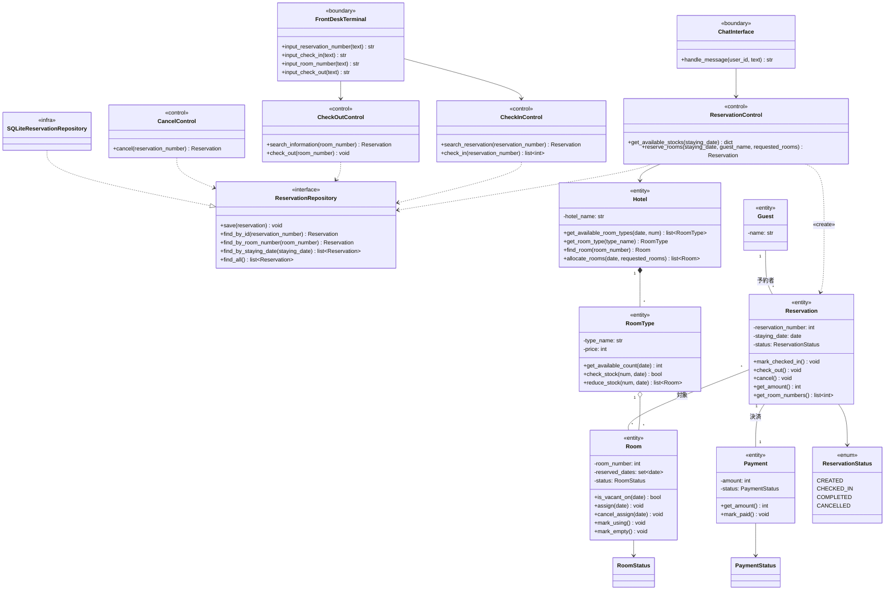
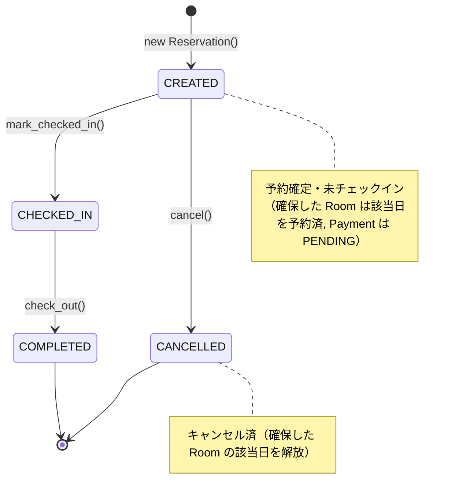
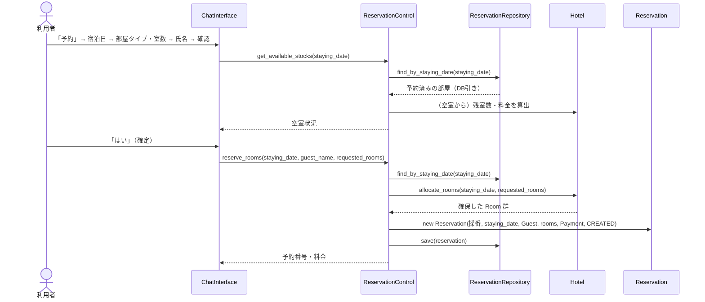
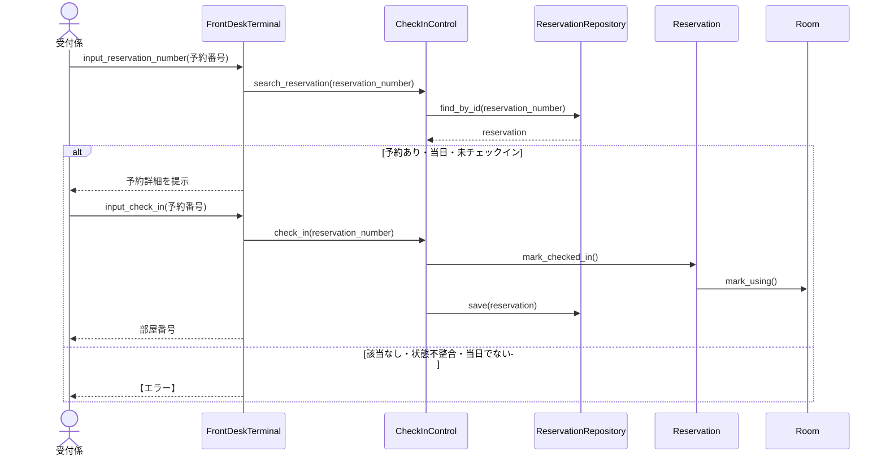
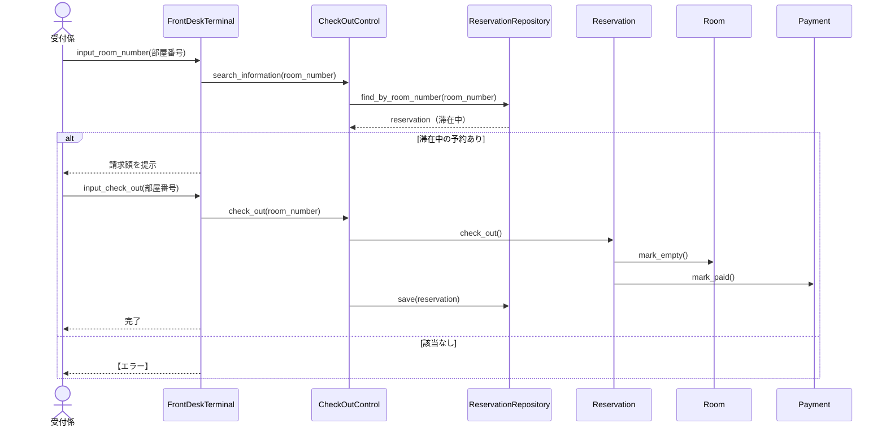

# 設計

ホテル予約システム (HRS) の設計の成果物をまとめた。本システムは, LINE Messaging API とフロントデスク Web 画面を用いて, ホテルの予約・チェックイン・チェックアウトを行うシステムであり, 実装言語は Python とする。

設計は, 分析モデル (システム分析の成果物) をもとに, 実装方法を加味して, 基本設計 (アーキテクチャ設計) と詳細設計 (型付き設計クラス図・ステートマシン図・シーケンス図) を行う。

> 本書は実装済みのシステムに合わせて改訂した詳細設計である。アーキテクチャ全体像・パッケージ構成は [Architecture.md](Architecture.md) を, ドメインの概念モデルは [Domain_Analysis.md](Domain_Analysis.md) を参照のこと。

## 設計上の決定事項

- **データの永続化**: `ReservationRepository` (抽象) で永続化を隠蔽し, 具象として **SQLite** 実装 (`SQLiteReservationRepository`) を用いる。上位層は抽象にのみ依存する (DIP) ため, 別の DB への差し替えが容易である。
- **日付ベースの在庫管理 (DB引き)**: 空室状況はメモリ上に在庫数を保持せず, その宿泊日の予約をリポジトリから引いて算出する。`Room` は自身が予約されている日付集合 `reserved_dates` を管理し, 同一部屋の別日予約を許容する。
- **予約の状態 `status`**: `ReservationStatus` 列挙型 (`CREATED` / `CHECKED_IN` / `COMPLETED` / `CANCELLED`) で表し, `mark_checked_in()` / `check_out()` / `cancel()` で遷移する。
- **複数部屋・一括精算**: 1つの予約は複数の部屋を対象にでき, 決済 (`Payment`) は予約単位で一括して扱う。
- **予約番号 `reservation_number`**: 6桁の整数 (100000〜999999) を, 未使用のものが出るまでランダムに採番する (アプリケーション層の責務)。
- **命名規約**: クラスは PascalCase, メソッド・属性は Python 慣習の snake_case とする。

---

# 1. 基本設計

## 1.1 アーキテクチャ設計 (多層アーキテクチャ)

変更容易性 (特にユーザインタフェースの変更への強さ) を重視し, 多層アーキテクチャ (Layers パターン) を採用する。分析のロバストネス分析で識別したバウンダリ・コントロール・エンティティを, 次の各層に割り当てる。予約は**利用者が LINE** で, チェックイン・チェックアウトは**受付係がフロントデスク (Web) 画面**で行う, 2 チャネルの UI を持つ。

```mermaid
flowchart TD
    LINE([LINE Messaging API]):::ext
    FRONT([フロントデスク Web 画面 / 受付係]):::ext

    subgraph P[プレゼンテーション層]
        CI["ChatInterface «boundary»（LINE・予約）"]
        FD["FrontDeskTerminal «boundary»（受付・チェックイン/アウト）"]
        SM["SessionManager（LINE 対話状態）"]
    end
    subgraph A[アプリケーション層]
        RC["ReservationControl «control»"]
        KC["CheckInControl «control»"]
        OC["CheckOutControl «control»"]
        CC["CancelControl «control»（保守拡張）"]
    end
    subgraph D[ドメイン層]
        HT["Hotel «entity»"]
        RT["RoomType «entity»"]
        RM["Room «entity»"]
        RV["Reservation «entity»"]
        PM["Payment «entity»"]
        G["Guest «entity»"]
        EN["ReservationStatus / RoomStatus / PaymentStatus «enum»"]
        REPO_IF["ReservationRepository «interface»"]
    end
    subgraph I[インフラストラクチャ層]
        REPO["SQLiteReservationRepository «infra»"]
        DB[(SQLite)]:::ext
    end

    LINE -. Webhook（予約） .- CI
    FRONT -. 操作（チェックイン/アウト・予約一覧） .- FD
    CI --> SM
    CI --> RC
    FD --> KC
    FD --> OC
    RC --> HT
    RC --> REPO_IF
    KC --> REPO_IF
    OC --> REPO_IF
    CC --> REPO_IF
    HT --> RT
    RT --> RM
    RV --> RM
    RV --> PM
    RV --> G
    RV --> EN
    REPO ..|> REPO_IF
    REPO --> DB

    classDef ext fill:#eee,stroke:#999;
```

各層の責務は次のとおりである。

| 層 | クラス | 責務 |
| --- | --- | --- |
| プレゼンテーション層 | ChatInterface, FrontDeskTerminal, SessionManager | LINE / フロントデスク Web 画面との連携。入力の受け取りと応答の生成。LINE 側は多ターン対話の状態を SessionManager で保持する。 |
| アプリケーション層 | ReservationControl, CheckInControl, CheckOutControl, CancelControl | 各ユースケースの制御ロジック。ドメイン層とリポジトリを協調させる進行役。ビジネスルールはドメインへ委譲する。 |
| ドメイン層 | Guest, Hotel, RoomType, Room, Reservation, Payment, 各列挙型, ReservationRepository (契約) | 業務の中核データとロジック (空室判定・状態遷移・一括精算)。他のどの層もインポートしない。 |
| インフラストラクチャ層 | SQLiteReservationRepository | ドメインが定義した `ReservationRepository` の契約に従い, SQLite への保存・復元を行う。 |

依存の方向は上位層から下位層への一方向とし, 下位層は上位層を知らない。インフラ層はドメイン層の**インタフェース**に依存する (依存関係逆転の原則)。

## 1.2 設計順序 (Inside-Out 原則)

変更されにくい (安定した) 中心から外側へ向かって設計・実装する。

1. ドメイン層のエンティティ (Room, RoomType, Reservation, Payment, Hotel, Guest, 列挙型)
2. データソースの契約 (ReservationRepository) と具象 (SQLiteReservationRepository)
3. アプリケーション層のコントロール (ReservationControl, CheckInControl, CheckOutControl, CancelControl)
4. プレゼンテーション層 (ChatInterface / SessionManager, FrontDeskTerminal, 管理者 Web 画面)

## 1.3 適用する設計原則・パターン

| 原則・パターン | 適用箇所 | ねらい |
| --- | --- | --- |
| Layers (多層アーキテクチャ) | 全体 | 関心の分離。UI (LINE / Web) の変更を局所化する。 |
| Repository パターン | ReservationRepository | 永続化方式の隠蔽。SQLite ↔ 他 DB の差し替えを容易にする。 |
| 依存関係逆転の原則 (DIP) | インフラ → ドメインの契約 | ビジネスロジックが永続化の詳細に依存しない。 |
| リッチドメインモデル | 各エンティティ | 空室判定・状態遷移・一括精算をドメインに置き, コントロールは進行役に徹する。 |
| 単一責任の原則 (SRP) | 各コントロール | 1ユースケース1コントロール。予約の検索責務はリポジトリへ。 |
| 列挙型による状態表現 | ReservationStatus / RoomStatus / PaymentStatus | 状態の取り違えを防ぐ。 |

---

# 2. 詳細設計

## 2.1 名前対応表 (分析レベル → 設計レベル)

| 分析レベル | 設計レベル (Python) | 種別 |
| --- | --- | --- |
| Chat_Interface | ChatInterface（予約）/ FrontDeskTerminal（チェックイン・アウト） | バウンダリ |
| Reservation_Control | ReservationControl | コントロール |
| CheckIn_Control | CheckInControl | コントロール |
| CheckOut_Control | CheckOutControl | コントロール |
| (保守拡張) | CancelControl | コントロール |
| Guest | Guest | エンティティ |
| Hotel | Hotel | エンティティ |
| RoomType | RoomType | エンティティ |
| Room | Room | エンティティ |
| Reservation | Reservation | エンティティ |
| Payment | Payment | エンティティ |
| (新規) | ReservationStatus / RoomStatus / PaymentStatus | 列挙型 |
| (分析の予約保管庫に相当) | ReservationRepository（契約）/ SQLiteReservationRepository（具象） | データソース |
| (LINE 対話状態) | SessionManager | プレゼンテーション補助 |

### 主な属性 (型付き)

| クラス | 属性 | 型 |
| --- | --- | --- |
| Guest | name | str |
| Reservation | reservation_number | int |
| Reservation | staying_date | date |
| Reservation | status | ReservationStatus |
| RoomType | type_name / price | str / int |
| Room | room_number | int |
| Room | reserved_dates | set[date] |
| Room | status | RoomStatus |
| Payment | amount / status | int / PaymentStatus |
| Hotel | hotel_name | str |

### 主なメソッド

| 分析レベル操作 | 設計レベルメソッド | 備考 |
| --- | --- | --- |
| ReservationControl.searchRoom() | get_available_stocks(staying_date) -> dict | 空室状況（残室数・料金）を返す |
| ReservationControl.reserveRoom() | reserve_rooms(staying_date, guest_name, requested_rooms) -> Reservation | 複数タイプ・複数室を一括確保 |
| CheckIn_Control.CheckIn() | check_in(reservation_number) -> list[int] | 割り当て部屋番号を返す |
| CheckOut_Control.CheckOut() | check_out(room_number) -> None | 一括精算・空室化 |
| Hotel.getAvailableRoomTypes() | get_available_room_types(staying_date, num) | |
| Hotel.allocateRooms() | allocate_rooms(staying_date, requested_rooms) -> list[Room] | All or Nothing |
| Reservation.markCheckedIn() | mark_checked_in() | CREATED→CHECKED_IN（当日のみ） |
| Reservation.checkOut() | check_out() | CHECKED_IN→COMPLETED（一括精算） |
| Reservation.cancel() | cancel() | CREATED→CANCELLED |
| Reservation.getReservation() | (Repository へ移動) find_by_id / find_by_room_number / find_by_staying_date / find_all | 検索責務はデータソース層へ |

注記: 分析で `Reservation` の操作としていた予約の検索は, 設計では `ReservationRepository` の責務へ移す (単一責任の原則)。

## 2.2 設計レベル・クラス図



制約: 同一の部屋について, 同一の宿泊日 (`staying_date`) を対象とする有効な予約は高々1つである。本制約は, 予約時に `ReservationControl` が `ReservationRepository.find_by_staying_date()` からその日の予約済み部屋を導出し (DB引き), 空室のみを `Hotel.allocate_rooms()` で割り当てることで保証する。

## 2.3 ステートマシン図 (Reservation の status)



ガード条件:

- `mark_checked_in()` は `status == CREATED` かつ**宿泊日が当日**の場合のみ受理する (UC2 備考「チェックインは宿泊日に行う」)。それ以外は `BureaucraticError` を送出する。
- `check_out()` は `status == CHECKED_IN` の場合のみ受理し, 紐づく全部屋を空室化 (`Room.mark_empty()`) し, `Payment` を PAID にする (一括精算)。
- `cancel()` は `status == CREATED` の場合のみ受理する。
- **Payment**: PENDING → PAID (`check_out()` 内)。 **Room**: VACANT ↔ IN_USE (`mark_using()` / `mark_empty()`)。予約日集合 `reserved_dates` は `assign()` / `cancel_assign()` で増減する。

## 2.4 主要シーケンス図

### SD1. 部屋を予約する (LINE)



補足: 空室判定・確保はいずれも「その宿泊日の予約を DB から引いて空室を求める」DB引きで行う。複数タイプ・複数室は All or Nothing で確保し, 料金は予約単位で合算して `Payment` に持たせる。

### SD2. チェックインする (フロントデスク)



### SD3. チェックアウトする (フロントデスク)



---

# 3. UI 連携の設計 (プレゼンテーション層)

## 3.1 LINE（利用者・予約）

`ChatInterface` は, LINE Messaging API との連携を実現する。

- Webhook で LINE からのイベント (利用者のテキストメッセージ) を受信し, 応答メッセージ (reply) を返す。実装には FastAPI と `line-bot-sdk` v3 を使用し, Channel secret と Channel access token は環境変数から取得する。
- 予約ユースケースは複数ターンの対話 (予約→日付→部屋タイプ・室数→氏名→確認→確定) からなるため, `SessionManager` が LINE ユーザ識別子をキーに会話の進行状態 (`SessionState`) を保持する。
- チェックイン・チェックアウトは LINE では受け付けず, フロントへ案内する。

## 3.2 フロントデスク Web 画面（受付係・チェックイン/アウト・予約一覧）

- `FrontDeskTerminal` が UC2/UC3 を担当する。SessionManager を介さず, 受付係の1操作 (照会 → 確定) ごとに完結する。
- FastAPI が管理者向け Web 画面 (`/front`) と API を配信する。パスワード認証 (環境変数 `ADMIN_PASSWORD`) でログインし, 以降の API はトークンで保護する。
- 機能: 予約一覧 (予約日順・番号/名前/日付/部屋番号で検索), チェックイン (本日分), チェックアウト (宿泊中)。

注記: 会話状態の管理 (LINE) と 2 チャネル UI の分離は本システム特有の設計事項であり, チャットボット化・フロント業務に伴う実装上の関心事である。

---

# 4. 設計レビュー自己点検

| 観点 | 確認 |
| --- | --- |
| 全ての分析クラス・操作が, 設計クラス・メソッドに対応している (追跡可能性) | ○ (名前対応表で対応付け) |
| 実装方法 (Python の型・列挙型・SQLite) を加味している | ○ |
| 変更容易性: UI の変更が局所化されている | ○ (2 チャネル UI を分離。多層アーキテクチャ) |
| 永続化の詳細が隠蔽されている | ○ (Repository による抽象化。具象は SQLite) |
| リッチドメイン: ビジネスルールがドメインに集約されている | ○ (状態遷移・空室判定・一括精算) |
| 単一責任: 1ユースケース1コントロール, 検索責務はRepositoryへ | ○ |
| ステートフルなクラスの状態遷移が設計されている | ○ (Reservation / Room / Payment) |
| 制約 (二重予約の禁止) の保証箇所が明確である | ○ (DB引きによる空室判定で保証) |

---

# 5. 実装との対応

設計クラスは次のパッケージへ写像して実装している (詳細は [.code/code_structure.md](.code/code_structure.md))。

1. `domain/models.py`, `domain/repository_interface.py` (ドメイン層)
2. `infrastructure/sqlite_reservation_repository.py` (インフラ層)
3. `application/*.py` (ReservationControl, CheckInControl, CheckOutControl, CancelControl)
4. `ui/chat_interface.py`, `ui/session_manager.py`, `ui/front_desk_terminal.py`, `ui/static` / `ui/templates` (プレゼンテーション層)
5. `main.py` (LINE Webhook + 各層の結合), `web_frontdesk.py` (管理者 Web アプリのファクトリ), `debug_web.py` (LINE 非依存のデバッグサーバ)

各層には単体テストを用意している (`.code/tests/`): ドメインの状態遷移・空室判定, ChatInterface の対話状態機械, FrontDeskTerminal の照会→確定, Web エンドポイントの通し確認。
