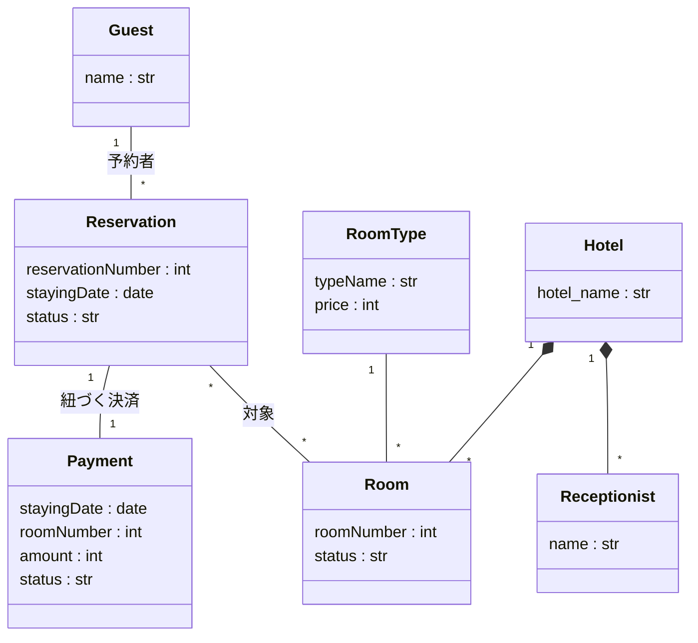
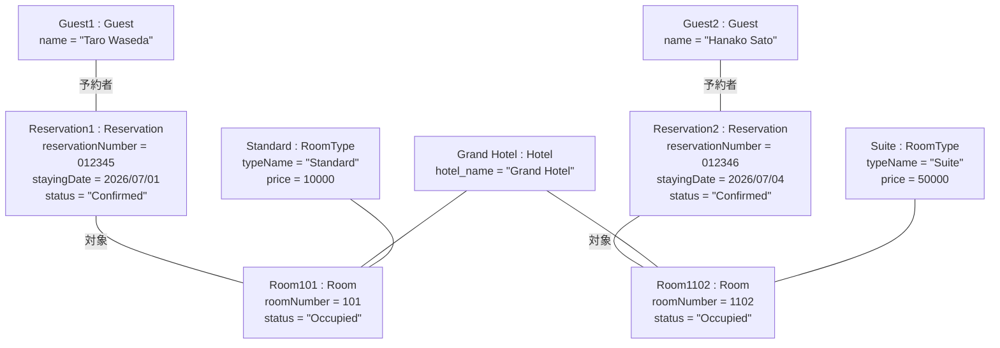

# 概念モデル (ドメイン分析)

ホテル予約システム (HRS) のドメイン分析の成果物である概念モデルをまとめた。
本システムは, LINE Messaging APIを用いて, ホテルの予約・チェックイン・チェックアウトを行うチャットボット型システムである。

概念モデルは, 対象とする問題領域の本質的な概念と概念間の関係のみを表す。実装技術 (LINE API, チャットボット等) やシステムそのものは, 概念モデルには含めていない。

## 前提条件

- 客は1泊のみ宿泊し, 翌日に必ずチェックアウトする (連泊は想定しない)。
- 1つの予約は, 1泊を対象とする。
- 予約番号, 部屋番号, 宿泊料 (料金) は, 必ずシステムが扱う要素とする。

余力があれば後に変更してもいいかも...

## クラス図

制約: 同一の部屋について, 同一の宿泊日 (stayingDate) を対象とする予約は高々1つである (二重予約の禁止)。

### クラスの説明

| クラス | 役割 | 属性 | 説明 |
| --- | --- | --- | --- |
| Guest | もの  (主体) | name | 予約を行う客。 |
| Receptionist | もの  (主体) | name | ホテルの受付係。 |
| Reservation | こと | reservatioNumber, stayingData, status | 客と部屋を結ぶ予約という事象。連泊なしのため日付は宿泊日 (チェックイン日) 1つで足りる。|
| RoomType | もの  (概念) | typeName, price | 部屋の種類（シングル、ツイン、スイートなど）。price（宿泊料）は部屋タイプごとに設定される。|
| Room | もの  (対象) | roomNumber, status | 予約の対象となる具体的な部屋。ホテル（Hotel）に保有され、特定の部屋タイプ（RoomType）に属する。statusは空室状況などを表す。|
| Hotel | もの  (場所) | hotel_name | 部屋を保有する全体としての概念。|
| Payment | こと   | stayingDate, roomNumber, amount, status | 予約（Reservation）に1対1で紐づく決済という事象。宿泊日、部屋番号、金額（amount）、支払状態（status）を管理する。|

### 関連と多重度

| 関連 | 多重度 | 読み方 |
| --- | --- | --- |
| Hotel *— Room | 1 対 * | 1つのホテルは複数の部屋を保有する (コンポジション)。|
| Hotel *— Receptionist | 1 対 * | 1つのホテルは複数の受付係を保有する (コンポジション)。|
| RoomType — Room | 1 対 * | 1つの部屋タイプは、該当する複数の具体的な部屋を保有する 。|
| Guest — Reservation (予約者) | 1 対 * | 1人の客は複数の予約を行いうるが, 1つの予約は1人の客に帰属する。|
| Reservation — Room (対象) | * 対 * | 1つの予約は1つ以上の部屋を対象とする。1つの部屋は, 宿泊日が異なれば複数の予約の対象となりうる。|
| Reservation -- Payment (紐づく決済) | 1 対 1 | 1つの予約に対して、決済は必ず1つだけ一意に紐づく。。|

## オブジェクト図

グランドホテルが2つの部屋を保有し, 2人の客がそれぞれ異なる日に異なる部屋を予約した状況（未チェックイン）を表す。

この図により, 各クラスがインスタンス化可能であること, および多重度・制約と矛盾しないことを確認できる。

---
