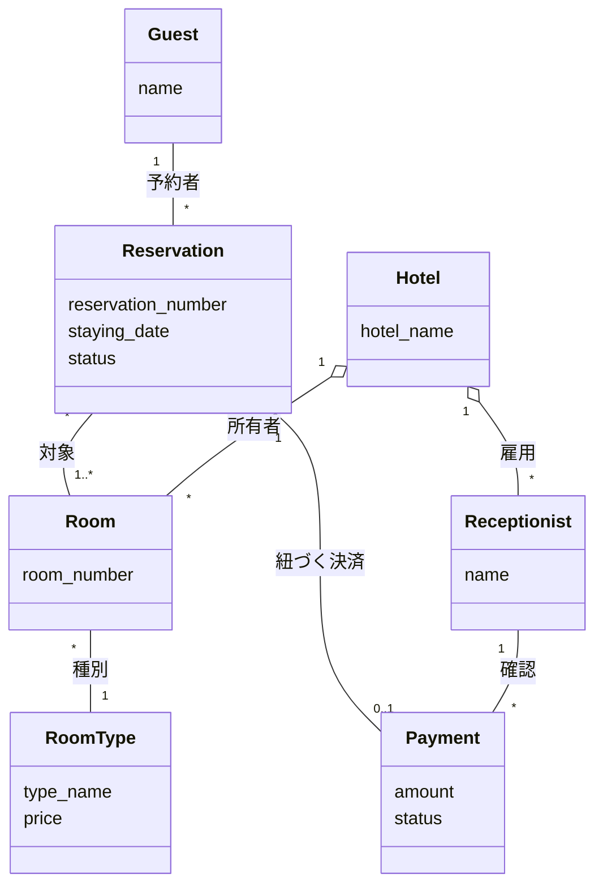
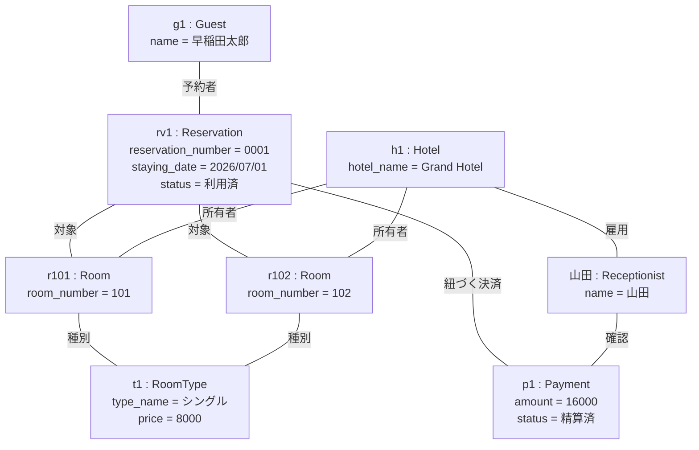

# 概念モデル (ドメイン分析)

ホテル予約システム (HRS) のドメイン分析の成果物である概念モデルをまとめた。
本システムは, LINE Messaging APIを用いて, ホテルの予約・チェックイン・チェックアウトを行うチャットボット型システムである。

概念モデルは, 対象とする問題領域の本質的な概念と概念間の関係のみを表す。実装技術 (LINE API, チャットボット等) やシステムそのものは, 概念モデルには含めていない。

 

## 前提条件

- 客は1泊のみ宿泊し, 翌日に必ずチェックアウトする (連泊は想定しない)。
- 1つの予約は1つ以上の部屋を対象とする (団体予約を許す)。予約時に対象の部屋を確定する。
- 予約番号, 部屋番号, 宿泊料は, 必ずシステムが扱う要素とする。
- 宿泊料は部屋種別ごとの料金とし (当面は種別が1つで実質定額), 1予約の支払い額は割り当てた部屋の料金の合計とする。
- チェックアウトの支払いは現金のみとする。現金の受領完了は受付係が確認し, システムへ通知する。
- 利用者とシステムの対話は, すべて LINE を通じて行う (LINE は実装・チャネルであり, 概念モデルには登場させない)。

余力があれば後に変更してもいいかも...

 

## クラス図

制約: - 
- **同一の部屋は, 同一の宿泊日について複数の予約に割り当てられない** (同一宿泊日での二重割当の禁止)。多重度 `* — 1..*` は時期 (宿泊日) をまたいだ再利用を許すため, 同一宿泊日の重複はこの制約で防ぐ。
- 1つの予約に割り当てられる部屋はすべて, その予約の宿泊日 (staying_date) を共有する。
- ある宿泊日・種別の割り当て済み部屋数は, その種別の部屋数を超えない (超過予約の禁止)。

 

### クラスの説明

## クラスの説明

| クラス | 役割 | 属性 | 説明 |
| --- | --- | --- | --- |
| Guest | もの (主体) | name | 予約を行う利用者。LINE を通じて操作する。識別は LINE ユーザ識別子 (設計レベル)。 |
| Reservation | こと | reservation_number, staying_date, status | 宿泊日に対する1室以上の確保。status は 予約済 → 利用済。対象の部屋は予約時に確定する。 |
| RoomType | もの (区分) | type_name, price | 部屋の種別と料金。種別追加は RoomType のインスタンス追加で行える。総室数は属さず, Room の数から導出する。 |
| Room | もの (資源) | room_number | 個別の部屋。占有状態は予約とのリンクから導出する。 |
| Payment | こと | amount, status | チェックイン時に予約ごとに発生する支払い。amount は割り当てた部屋の料金の合計 (確定時のスナップショット)。status は 未精算 → 精算済。 |
| Hotel | もの (場所) | hotel_name | 部屋と受付係を擁する全体としての概念 (集約ルート)。 |
| Receptionist | もの (主体) | name | 受付係。チェックアウト時に現金の受領完了を確認し, システムへ通知する。 |

 

### 関連と多重度

| 関連 | 多重度 | 読み方 |
| --- | --- | --- |
| Guest — Reservation (予約者) | 1 対 * | 1人の利用者は複数の予約を行いうるが, 1つの予約は1人の利用者に帰属する。 |
| Reservation — Room (対象) | * 対 1..* | 1つの予約は1つ以上の部屋を対象とする。1つの部屋は, 宿泊日が異なれば複数の予約の対象となりうる。 |
| Reservation — Payment (紐づく決済) | 1 対 0..1 | 1つの予約に対し支払いは高々1つ (チェックイン時に生成)。1つの支払いは1つの予約に対応する。 |
| Room — RoomType (種別) | * 対 1 | 各部屋は1つの種別に属する。 |
| Hotel — Room (所有者) | 1 対 * | 1つのホテルは複数の部屋を保有する (集約)。 |
| Hotel — Receptionist (雇用) | 1 対 * | 1つのホテルは複数の受付係を擁する (集約)。 |
| Receptionist — Payment (確認) | 1 対 * | 受付係は複数の支払いの現金受領を確認しうる。1つの支払いの確認は1人の受付係が行う。 |

 
 

## オブジェクト図

利用者の早稲田太郎が 2026/07/01 の宿泊でGrand Hotelの **2室を予約 (団体予約)**, 部屋101・102 (シングル) を予約時に確定し, チェックインで予約ごとに1件の支払い (8000 × 2 = 16000円) が発生, 受付係 山田が現金受領を確認した状況を表す。

 

この図により, 各クラスがインスタンス化可能であること, および多重度・制約と矛盾しないことを確認できる。

 

---
## 今後の検討事項

- **部屋番号の通知タイミング.** 部屋は予約時に確定するため, 部屋番号を予約時に伝えるか, チェックイン時に伝えるかは UX の選択として決める。
- **設計への申し送り.** status は列挙型 (Enum) として実装する。超過予約・二重割当の保証は予約処理が担う。予約時の部屋確定は同時実行の競合に注意し, ロック等を設計する。物理的な部屋状態 (清掃中・整備中など, 予約から導出できない状態) が必要になった場合は, その時点で Room に状態を追加する。
- 予約のキャンセル・変更を概念・機能として加えるか (現状は対象外)。
