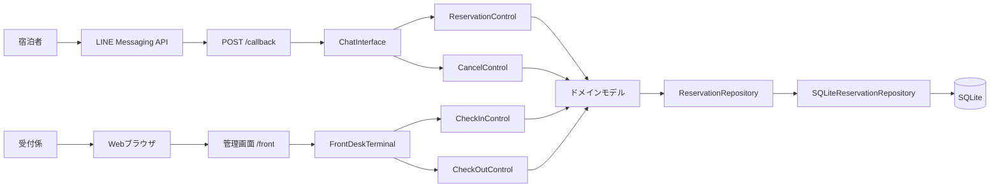
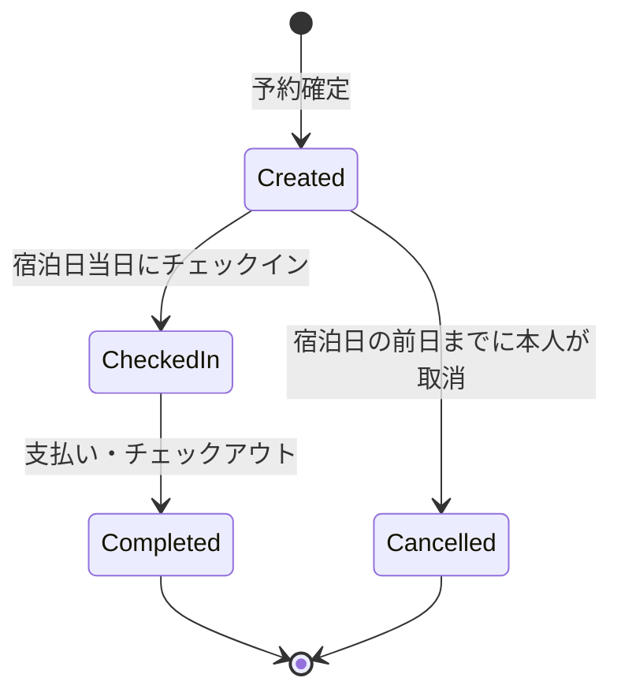

# HRS — ホテル予約システム

HRSは、LINEを利用する宿泊者とWeb画面を利用する受付係をつなぐホテル予約システムです。予約からチェックアウトまでの主要な業務フローを、FastAPIとSQLiteで実装しています。

## 主な機能

| 利用者 | 操作 |
| --- | --- |
| 宿泊者（LINE） | 予約、予約確認、予約キャンセル |
| 受付係（Web） | 予約一覧、チェックイン、チェックアウト |

- UC1: 予約
- UC2: チェックイン
- UC3: チェックアウト
- UC4: 予約キャンセル
- SQLiteによる予約データの永続化
- 管理画面のパスワード認証
- LINE Webhookの署名検証
- pytestによるドメイン、アプリケーション、UI、Web APIの自動テスト

## システムの全体像

HRSには、宿泊者向けのLINEチャネルと受付係向けのWebチャネルがあります。入口は異なりますが、どちらもアプリケーション層を通して同じドメインモデルと予約リポジトリを操作します。



### レイヤーと責務

| レイヤー | 主な要素 | 責務 |
| --- | --- | --- |
| UI | `ChatInterface`, `FrontDeskTerminal`, FastAPI | LINE／Webからの入力受付、対話状態、表示用メッセージ |
| アプリケーション | `ReservationControl`, `CheckInControl`, `CheckOutControl`, `CancelControl` | 各ユースケースの進行、リポジトリとドメインの調整 |
| ドメイン | `Hotel`, `RoomType`, `Room`, `Reservation`, `Guest`, `Payment` | 空室、料金、状態遷移、キャンセル期限などの業務ルール |
| インフラストラクチャ | `SQLiteReservationRepository` | 予約と部屋割り当ての保存・検索・復元 |

上位層は `ReservationRepository` インターフェースに依存し、SQLite固有の処理をインフラストラクチャ層へ閉じ込めています。

## ユースケースの処理

### UC1: 予約

1. 宿泊者がLINEで「予約」を選択します。
2. 宿泊日を受け取り、過去の日付でないことを確認します。
3. 対象日の予約をSQLiteから取得し、部屋ごとの在庫状態を同期します。
4. 空いている部屋タイプ、残室数、料金を提示します。
5. 部屋タイプと室数、宿泊者名を受け取って見積金額を表示します。
6. 確認後、すべての部屋を一括確保します。一部の部屋だけ確保することはありません。
7. 未使用の6桁予約番号を発行し、LINE user IDとともに予約を保存します。

在庫の正本はSQLiteです。メモリ上の `Room.reserved_dates` は、操作対象日のDB情報から毎回再構築されます。これにより、プロセス再起動後も予約済みの部屋を空室として扱うことを防ぎます。

### UC2: チェックイン

1. 受付係が管理画面へログインします。
2. システムが本日分かつ `Created` 状態の予約を候補として表示します。
3. 受付係が予約番号で予約内容を照会し、宿泊者と内容を確認します。
4. 確定すると、宿泊日が当日であることを再検証します。
5. 予約を `CheckedIn`、割り当てられた全部屋を `InUse` に変更して保存します。

### UC3: チェックアウト

1. システムが `CheckedIn` 状態の予約を候補として表示します。
2. 受付係が部屋番号を入力し、滞在中の予約と請求額を照会します。
3. 支払い受領後にチェックアウトを確定します。
4. 支払いを `Paid`、予約を `Completed`、予約内の全部屋を `Vacant` に変更して保存します。

複数部屋を含む予約は、いずれかの部屋番号から照会し、予約単位で一括チェックアウトします。

### UC4: 予約キャンセル

1. 宿泊者がLINEで「予約キャンセル」を選択します。
2. LINE user IDに紐づく予約だけを検索し、他人の予約情報は返しません。
3. 予約番号と予約者名を確認して、最終確認を表示します。
4. 本人の予約であること、状態が `Created` であること、宿泊日の前日までであることを検証します。
5. 予約を `Cancelled` に変更し、確保していた対象日の部屋を解放して保存します。

チェックイン済み、完了済み、宿泊日当日以降の予約はキャンセルできません。

## 予約の状態遷移



状態遷移の可否は `Reservation` が判定します。不正な遷移や業務ルール違反は `BureaucraticError` としてUI層へ伝えられ、利用者向けのメッセージに変換されます。

## 主要データモデル

| モデル | 保持する情報・役割 |
| --- | --- |
| `Hotel` | 部屋タイプの集合、複数タイプの一括在庫確認・確保 |
| `RoomType` | タイプ名、1室あたりの料金、所属する部屋 |
| `Room` | 部屋番号、予約済み日付、現在の利用状態 |
| `Reservation` | 予約番号、宿泊日、宿泊者、部屋、支払い、予約状態 |
| `Guest` | 宿泊者名、予約者本人を識別するLINE user ID |
| `Payment` | 合計金額、支払い状態 |

SQLiteには次の2テーブルを作成します。

- `reservations`: 予約番号、宿泊日、宿泊者、LINE user ID、金額、支払い状態、予約状態
- `reservation_rooms`: 予約番号と部屋番号の関連

保存処理は予約番号をキーに追加・更新し、部屋割り当ても同時に再構築します。既存DBに `guest_line_user_id` がない場合は、起動時に列を追加する簡易マイグレーションを実行します。

## LINE対話とセッション

`SessionManager` はLINE user IDごとに、現在の対話状態と入力途中の値をメモリ上で管理します。

- 予約: 宿泊日 → 部屋選択 → 宿泊者名 → 確認
- キャンセル: 予約番号 → 予約者名 → 確認

LINEのテキストメッセージ、日付選択のPostback、友だち追加イベントを処理し、状態に応じたクイックリプライを返します。対話セッションはプロセス内メモリにあるため、アプリを再起動すると入力途中の会話は初期状態へ戻ります。確定済みの予約データはSQLiteに残ります。

## HTTPエンドポイント

| メソッド・パス | 認証 | 用途 |
| --- | --- | --- |
| `GET /health` | 不要 | 稼働状態、LINE設定の有無、Webhookパスを返す |
| `POST /callback` | LINE署名 | LINEのMessage、Postback、Followイベントを受信 |
| `GET /front` | 不要 | 管理画面のHTMLを返す |
| `POST /front/login` | パスワード | 管理API用の一時トークンを発行 |
| `GET /front/reservations` | 管理トークン | 全予約を宿泊日順に取得 |
| `GET /front/checkin/candidates` | 管理トークン | 本日のチェックイン候補を取得 |
| `GET /front/checkout/candidates` | 管理トークン | チェックアウト候補を取得 |
| `POST /front/check-in/search` | 管理トークン | 予約番号でチェックイン内容を照会 |
| `POST /front/check-in/confirm` | 管理トークン | チェックインを確定 |
| `POST /front/check-out/search` | 管理トークン | 部屋番号で精算内容を照会 |
| `POST /front/check-out/confirm` | 管理トークン | チェックアウトを確定 |

管理画面のログインに成功すると、サーバープロセス内で生成されたトークンを返します。保護対象APIは `X-Admin-Token` ヘッダーでこの値を検証します。サーバーを再起動するとトークンは更新されるため、再ログインが必要です。

LINE Webhookは `X-Line-Signature` をChannel secretで検証します。LINEのアクセストークンまたはシークレットが未設定の場合、`POST /callback` は `503` を返しますが、管理画面とヘルスチェックは利用できます。

## 技術構成

- Python 3.11以上
- FastAPI / Uvicorn
- LINE Messaging API SDK v3
- SQLite
- pytest
- Docker / Docker Compose

依存パッケージは [requirements.txt](docs/setup/text/requirements.txt) で管理しています。

## Dockerで起動する

Docker Desktopが利用できる場合の推奨手順です。LINEの設定がなくても管理画面を確認できます。

### 1. 環境変数を用意する

```powershell
Copy-Item deploy/.env.example deploy/.env
```

macOS／Linuxの場合：

```bash
cp deploy/.env.example deploy/.env
```

`deploy/.env` を開き、`ADMIN_PASSWORD` を必ず安全な値へ変更してください。LINE連携を使用する場合は、同じファイルにアクセストークンとシークレットを設定します。

### 2. 起動する

```powershell
docker compose --env-file deploy/.env up --build -d
```

起動後の確認先：

- 管理画面: <http://localhost:8000/front>
- ヘルスチェック: <http://localhost:8000/health>

状態とログを確認するには、次を実行します。

```powershell
docker compose --env-file deploy/.env ps
docker compose --env-file deploy/.env logs --tail 100
```

### 3. 停止する

```powershell
docker compose --env-file deploy/.env down
```

SQLiteデータはDockerボリューム `hrs_hrs_data` に保持されます。データも削除したい場合に限り、`down` に `--volumes` を追加してください。

## Pythonで開発・実行する

以下はWindows PowerShellの例です。

### 1. 仮想環境と依存関係

```powershell
python -m venv .venv
.\.venv\Scripts\Activate.ps1
python -m pip install -r docs/setup/text/requirements.txt
```

macOS／Linuxでは、仮想環境を次のコマンドで有効化します。

```bash
source .venv/bin/activate
```

### 2. 自動テスト

```powershell
cd .code
python -m pytest scripts/tests -q
```

### 3. 管理画面のデバッグ起動

LINEを使わず、デモ予約を含む管理画面を起動します。

```powershell
cd .code
python -m scripts.debug.debug_web
```

- URL: <http://127.0.0.1:8000/front>
- 既定パスワード: `hrs-admin`（ローカルデバッグ専用）

### 4. ターミナルで業務フローを確認する

別々のターミナルで以下を実行すると、同じSQLiteファイルを利用して予約からチェックアウトまで確認できます。

```powershell
cd .code
python -m scripts.debug.debug_chat
```

```powershell
cd .code
python -m scripts.debug.debug_front
```

### 5. LINE Webhookを含めて起動する

あらかじめ `deploy/.env` にLINEの認証情報を設定します。

```powershell
cd .code
python -m uvicorn scripts.startup.main:app --env-file ../deploy/.env --reload --host 0.0.0.0 --port 8000
```

LINE公式アカウント、Webhook、Channel secret、Channel access tokenの設定方法は [LINE_SETUP.md](docs/setup/markdown/LINE_SETUP.md) を参照してください。

## 環境変数

| 変数 | 用途 | 既定値 |
| --- | --- | --- |
| `ADMIN_PASSWORD` | 管理画面のログインパスワード | `hrs-admin`（開発用） |
| `HRS_DB_PATH` | SQLiteファイルの保存先 | `.code/hrs.db` |
| `HRS_SEED_DEMO` | 起動時にデモ予約を投入するか | `false` |
| `HOST` | 本番起動サーバーの待受アドレス | `0.0.0.0` |
| `PORT` | 本番起動サーバーの待受ポート | `8000` |
| `LINE_CHANNEL_ACCESS_TOKEN` | LINE Messaging APIのアクセストークン | 未設定 |
| `LINE_CHANNEL_SECRET` | LINE Webhookの署名検証用シークレット | 未設定 |

Docker起動時は `HRS_ENV=production` が設定されます。この状態では、`ADMIN_PASSWORD` が未設定または開発用の既定値の場合、サーバーは起動しません。

`deploy/.env` はGit管理対象外です。秘密情報をコミット、Issue、Pull Request、ログへ記載しないでください。

## ディレクトリ構成

```text
HRS/
├── .code/
│   ├── application/       # ユースケース制御
│   ├── domain/            # 業務ルールとエンティティ
│   ├── infrastructure/    # SQLiteリポジトリ
│   ├── ui/                # LINE対話と管理画面
│   └── scripts/
│       ├── startup/       # 通常・コンテナ起動
│       ├── debug/         # 手動確認用スクリプト
│       ├── shared/        # 起動方法間の共有実装
│       └── tests/         # pytestテスト
├── deploy/                # 環境変数テンプレート
├── docs/                  # 設計・テスト・セットアップ資料
├── Dockerfile
└── compose.yaml
```

詳細は [code_structure.md](docs/development/markdown/code_structure.md) を参照してください。

## ドキュメント

### 分析・設計

| ドキュメント | 内容 |
| --- | --- |
| [Requirements_Analysis.md](docs/design/markdown/Requirements_Analysis.md) | 要求分析、ユースケース、アクティビティ図 |
| [Domain_Analysis.md](docs/design/markdown/Domain_Analysis.md) | ドメインの概念モデル |
| [System_Analysis.md](docs/design/markdown/System_Analysis.md) | ロバストネス分析、コミュニケーション図 |
| [Architecture.md](docs/design/markdown/Architecture.md) | レイヤー、パッケージ、状態遷移 |
| [Design.md](docs/design/markdown/Design.md) | クラス、状態遷移、シーケンスの詳細設計 |
| [UIdesign.md](docs/design/markdown/UIdesign.md) | UI要件 |
| [Cancel_Feature.md](docs/design/markdown/Cancel_Feature.md) | 予約キャンセル機能の仕様・設計・実装 |
| [Cancel_Feature_Proposal.md](docs/design/markdown/Cancel_Feature_Proposal.md) | 予約キャンセル機能の検討記録 |

PDF版は `docs/design/pdf/` にあります。

### テスト・開発

| ドキュメント | 内容 |
| --- | --- |
| [E2E_Test_Checklist.md](docs/testing/markdown/E2E_Test_Checklist.md) | LINEから管理画面までの実機テスト項目 |
| [E2E_Test_Report_2026-07-26.md](docs/testing/markdown/E2E_Test_Report_2026-07-26.md) | 実機テスト結果 |
| [LINE_SETUP.md](docs/setup/markdown/LINE_SETUP.md) | LINE Messaging APIの設定手順 |
| [code_structure.md](docs/development/markdown/code_structure.md) | 実装ディレクトリの詳細 |
| [TODO.md](docs/project/markdown/TODO.md) | 今後の対応項目 |
| [debuglist.md](docs/project/markdown/debuglist.md) | 修正項目の記録 |

## 運用上の注意

- SQLiteと管理者セッションは単一コンテナ／単一プロセスでの運用を前提としています。
- 複数インスタンスで運用する場合は、外部データベースと共有セッションストアが必要です。
- LINE連携を行わない場合でも管理画面は利用できます。`/health` の `line_configured` は `false` になります。
- 残課題と技術的負債は [TODO.md](docs/project/markdown/TODO.md) で管理しています。
