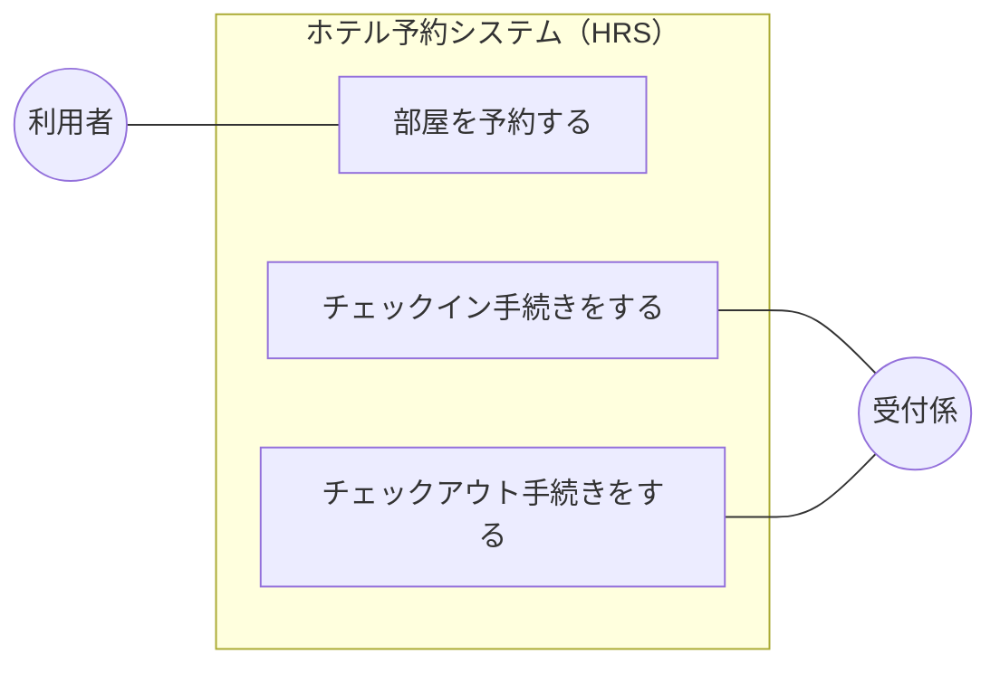
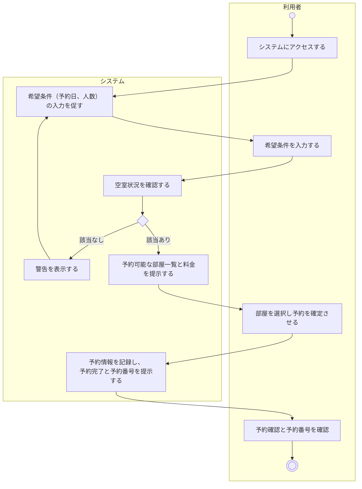
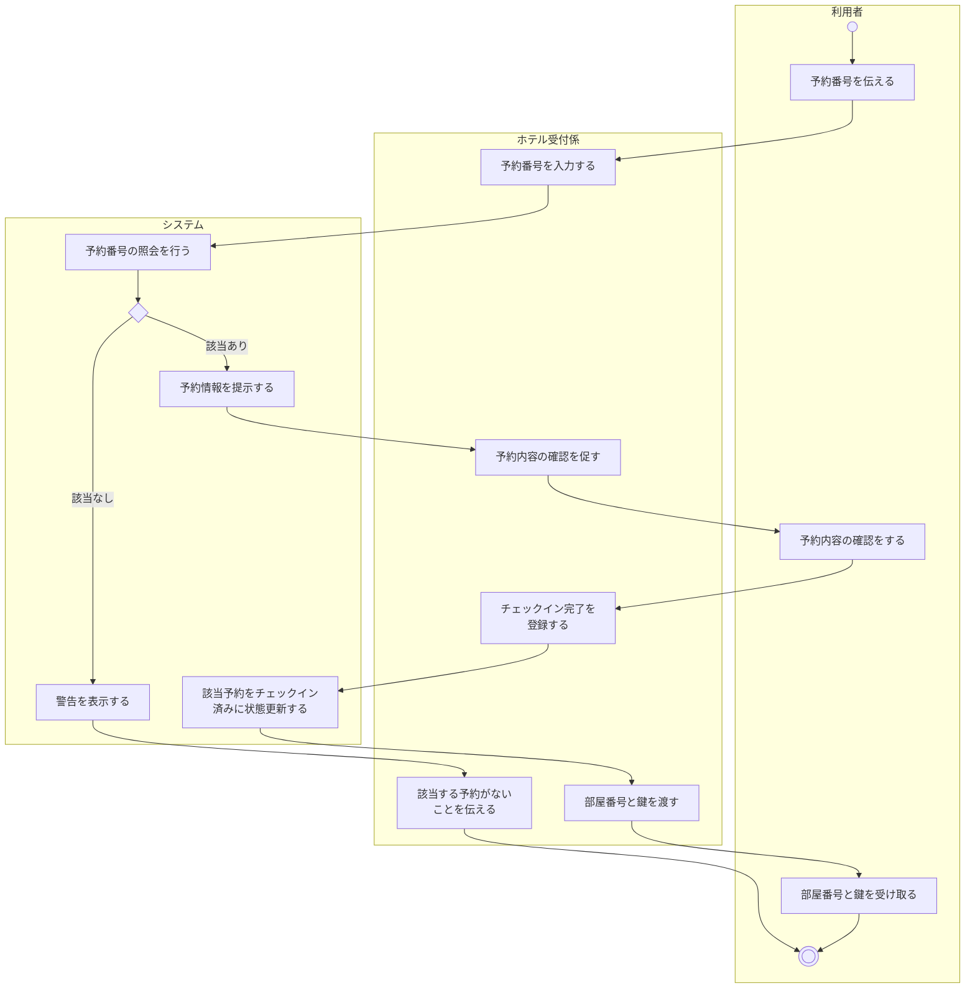
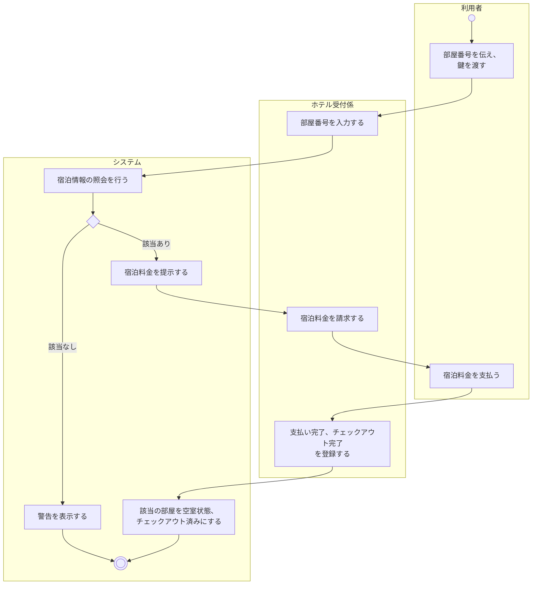

# 要求分析

ホテル予約システム (HRS) の要求分析の成果物をまとめた。本システムは, LINE Messaging APIを用いて, ホテルの予約・チェックイン・チェックアウトを行うチャットボット型システムである。

要求分析では, 概念モデルを参考に, 顧客がシステムに望む機能を明らかにし, ユースケース図・ユースケース記述・アクティビティ図として表す。

 

## 前提 (要求分析に関わるもの)

- 客は1泊のみ宿泊し, 翌日に必ずチェックアウトする (連泊は想定しない)。
- 予約時は宿泊日のみを指定し, システムが空室を自動で割り当てる。部屋番号はチェックイン時に通知する。
- 予約番号, 部屋番号, 宿泊料は必ずシステムが扱う。
- 利用者とシステムの対話は, すべてLINE上のチャットボットを通じて行う。
- 管理者 (部屋データの登録・管理) は今回の要求分析の範囲に含めない。

 

## アクタ

| アクタ | 種別 | 説明 |
| --- | --- | --- |
| 利用者 | 主アクタ  (人) | LINE を通じて予約・チェックイン・チェックアウトを自律的に行う宿泊客。 |
| 受付係 | 副アクタ   (人) | 部屋のチェックイン手続・チェックアウト手続をシステムを通じて行うホテルの受付係。 |

 

## ユースケース図

注記:
- 3つのユースケースには, 実行順序の前後関係 (予約 → チェックイン → チェックアウト) がある。これらは各ユースケース記述の事前条件として表す。
- LINE APIはあくまでインタフェースなので, ユースケース図には含めない。

 

---

## ユースケース記述

### UC1. 部屋を予約する

| 項目 | 内容 |
| --- | --- |
| ユースケース | 部屋を予約する |
| アクタ | 利用者 |
| 目的 | 利用者が, 希望条件に合った宿泊日の部屋を予約する |
| 事前条件 | （なし） |
| 事後条件 | 部屋の予約が完了し, 予約番号がシステムに記録され、利用者に提示されている |

基本系列
1. アクタは, システムに部屋を予約する旨を示す
2. システムは, アクタに希望条件（予約日, 人数）の入力を促す
3. アクタは, 希望条件を入力する
4. システムは, 空室状況を確認し, 予約可能な部屋一覧と料金を提示する
5. アクタは, 部屋を選択し予約を確定する
6. システムは, 予約情報を記録し, アクタに予約完了と予約番号を提示する

代替系列
- 基本系列4: 該当する空室がない場合は, 警告を表示し, 基本系列2へ戻る

備考
- 連泊は想定しない (1予約 = 1泊)

シナリオ
- 早稲田太郎は, システムに部屋を予約する旨を伝え, 宿泊日として2026/07/01を入力した。システムは部屋を1つ割り当てて予約を登録し, 予約番号012345を通知した。

---

 

### UC2. チェックイン手続きを行う

| 項目 | 内容 |
| --- | --- |
| ユースケース | チェックイン手続きを行う |
| アクタ | 受付係、利用者 |
| 目的 | 予約を持つ利用者がホテルに到着した際, 受付係がチェックイン処理を完了させる |
| 事前条件 | 利用者が事前に部屋の予約を行っている |
| 事後条件 | 当該予約のステータスがチェックイン済みに更新され, 部屋が割り当てられている |

基本系列
1. 利用者（アクタ）は, ホテル受付係（アクタ）に予約番号を伝える
2. ホテル受付係は, システムに予約番号を入力し、照会を行う
3. システムは, 予約情報（利用者名, 部屋番号）を提示する
4. ホテル受付係は, 内容を利用者と確認し, システムにチェックイン完了を登録する
5. システムは, 該当予約をチェックイン済みに状態更新する
6. ホテル受付係は, 利用者に部屋番号と鍵を渡す

代替系列
- 基本系列2: 該当する予約がない場合は, 警告を表示して終了する

備考
- チェックインはチェックイン日 (宿泊日) に行う。

シナリオ
- 早稲田太郎は, チェックインする旨を伝え, 予約番号012345を入力した。システムは部屋番号101を通知した。

---

 

### UC3. チェックアウト手続きを行う

| 項目 | 内容 |
| --- | --- |
| ユースケース | チェックアウト手続きを行う |
| アクタ | 受付係, 利用者 |
| 目的 | 宿泊を終えた利用者の精算を行い, チェックアウトを完了させる |
| 事前条件 | 利用者がチェックイン済みであり, 宿泊を終えている |
| 事後条件 | 宿泊料が精算され, システム上でチェックアウト完了状態として記録されている |

基本系列
1. 利用者（アクタ）は, ホテル受付係（アクタ）に部屋番号を伝える
2. ホテル受付係は, システムに部屋番号を入力する
3. システムは, 宿泊情報を照会し, 宿泊料金を提示する
4. ホテル受付係は, 利用者に宿泊料金を請求する
5. 利用者は, 料金を支払う
6. ホテル受付係は, システムに支払い完了およびチェックアウトを登録する
7. システムは, 該当部屋を空室状態・チェックアウト済みに更新する

代替系列
- 基本系列3: 該当する宿泊情報がない場合は, 警告を表示して終了する

備考
- チェックアウトは宿泊日の翌日に行う。

シナリオ
- 早稲田太郎は, チェックアウトする旨を伝え, 部屋番号101を入力した。システムは宿泊料10000円を通知した。早稲田太郎は宿泊料を支払い, システムはチェックアウトの完了を通知した。

---

 
 

## アクティビティ図

### AD1. 部屋を予約する

 

### AD2. チェックインする

 

### AD3. チェックアウトする

---

 

## 今後の検討事項

- 予約のキャンセルや変更を機能として加えるか (現状は対象外)。
- 部屋データの登録・管理を行う管理者を加えるか (現状は対象外)。
- システム使用中での「前の操作に戻る」・「最初からやり直す」機能の実装。
