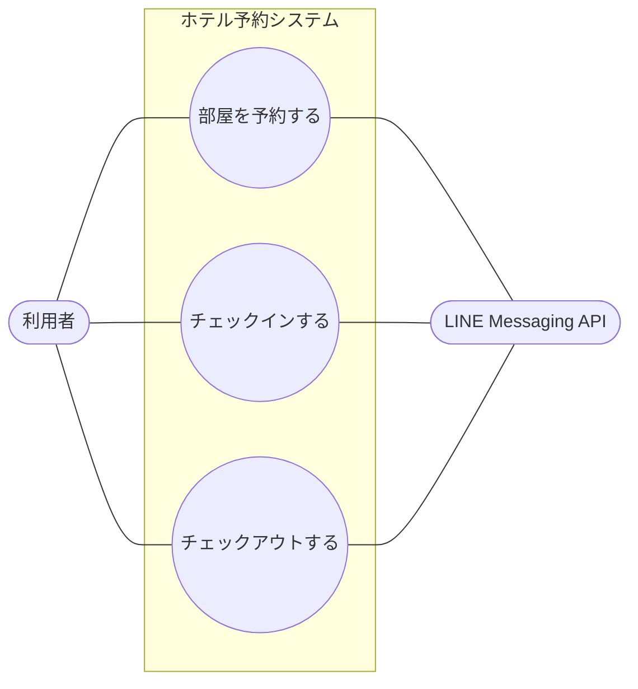
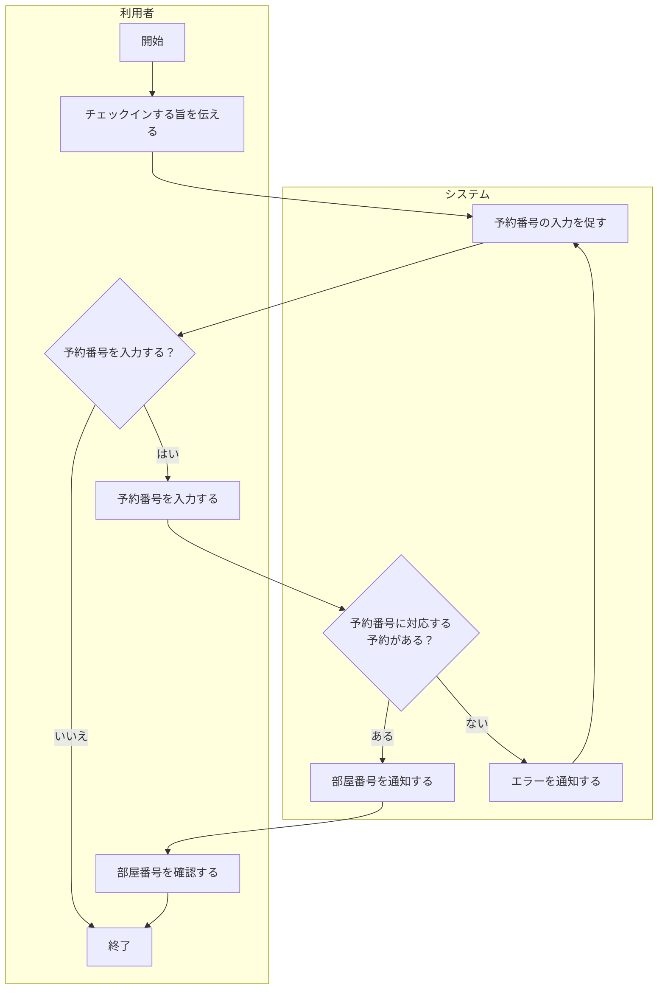
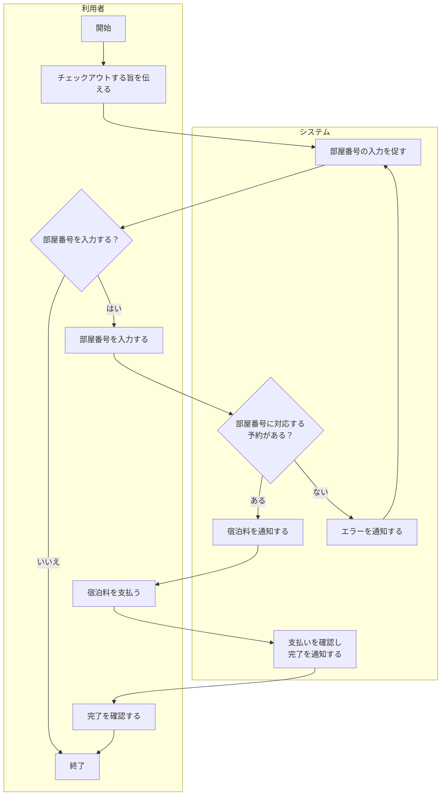

# 要求分析

ホテル予約システム (HRS) の要求分析の成果物をまとめた。本システムは, LINE Messaging APIを用いて, ホテルの予約・チェックイン・チェックアウトを行うチャットボット型システムである。

要求分析では, 概念モデルを参考に, 顧客がシステムに望む機能を明らかにし, ユースケース図・ユースケース記述・アクティビティ図として表す。

 

## 前提 (要求分析に関わるもの)

- 客は1泊のみ宿泊し, 翌日に必ずチェックアウトする (連泊は想定しない)。
- 予約時は宿泊日のみを指定し, システムが空室を自動で割り当てる。部屋番号はチェックイン時に通知する。
- 予約番号, 部屋番号, 宿泊料は必ずシステムが扱う。
- 利用者とシステムの対話は, すべてLINE上のチャットボットを通じて行う。
- 管理者 (部屋データの登録・管理) は今回の要求分析の範囲に含めない。

 

## アクタ

| アクタ | 種別 | 説明 |
| --- | --- | --- |
| 利用者 | 主アクタ  (人) | LINE を通じて予約・チェックイン・チェックアウトを行う宿泊客。 |
| LINE Messaging API | 副アクタ  (外部システム) | 利用者とシステムの間でメッセージを仲介する対話チャネル。図示は任意であり, 利用者のみを描いてもよい。 |

 

## ユースケース図

注記: 3つのユースケースには, 実行順序の前後関係 (予約 → チェックイン → チェックアウト) がある。これらは各ユースケース記述の事前条件として表す。

 

---

## ユースケース記述

### UC1. 部屋を予約する

| 項目 | 内容 |
| --- | --- |
| ユースケース | 部屋を予約する |
| アクタ | 利用者 |
| 目的 | 利用者が, 希望する宿泊日の部屋を予約する。 |
| 事前条件 | なし。 |
| 事後条件 | 入力された宿泊日について空室が1部屋割り当てられ, 予約が登録されて予約番号が発行されている。 |

基本系列

1. 利用者は, システムに, 部屋を予約する旨を伝える。
2. システムは, 利用者に, 宿泊日の入力を促す。
3. 利用者は, システムに, 希望する宿泊日を入力する。
4. システムは, 入力された宿泊日に予約可能な部屋を1つ割り当て, 予約を登録する。
5. システムは, 利用者に, 発行した予約番号を通知する。

代替系列

- 4a. 入力された宿泊日に予約可能な部屋がない場合, システムは, 利用者に予約できない旨を通知し, 予約を登録しない。

備考

- 連泊は想定しない (1予約 = 1部屋・1泊)。
- 部屋番号は本ユースケースでは通知せず, チェックイン時に通知する。

シナリオ

- 早稲田太郎は, システムに部屋を予約する旨を伝え, 宿泊日として2026/07/01を入力した。システムは部屋を1つ割り当てて予約を登録し, 予約番号012345を通知した。

 

### UC2. チェックインする

| 項目 | 内容 |
| --- | --- |
| ユースケース | チェックインする |
| アクタ | 利用者 |
| 目的 | 利用者が, 予約に基づいてチェックインし, 部屋番号を受け取る。 |
| 事前条件 | 利用者が, 有効な予約番号を持っている (予約済みである)。 |
| 事後条件 | 予約がチェックイン済みの状態になり, 利用者に部屋番号が通知されている。 |

基本系列

1. 利用者は, システムに, チェックインする旨を伝える。
2. システムは, 利用者に, 予約番号の入力を促す。
3. 利用者は, システムに, 予約番号を入力する。
4. システムは, 予約番号に対応する予約を確認し, 割り当てられた部屋の部屋番号を利用者に通知する。

代替系列
- 3a. 利用者が予約番号を入力しない場合, ユースケースを終了する。
- 4a. 入力された予約番号に対応する予約が存在しない場合, システムは, 利用者にエラーを通知し, 再度入力を促す (基本系列2へ戻る)。

備考

- チェックインはチェックイン日 (宿泊日) に行う。

シナリオ

- 早稲田太郎は, チェックインする旨を伝え, 予約番号012345を入力した。システムは部屋番号101を通知した。

 

### UC3. チェックアウトする

| 項目 | 内容 |
| --- | --- |
| ユースケース | チェックアウトする |
| アクタ | 利用者 |
| 目的 | 利用者が, チェックアウトして宿泊料を支払う。 |
| 事前条件 | 利用者がチェックイン済みで, 部屋番号を持っている。 |
| 事後条件 | チェックアウトが完了し, 宿泊料が利用者に通知され, 支払いが記録されている。 |

基本系列

1. 利用者は, システムに, チェックアウトする旨を伝える。
2. システムは, 利用者に, 部屋番号の入力を促す。
3. 利用者は, システムに, 部屋番号を入力する。
4. システムは, 部屋番号に対応する宿泊料を利用者に通知する。
5. 利用者は, 宿泊料を支払う。
6. システムは, 支払いを確認し, チェックアウトの完了を利用者に通知する。

代替系列
- 3a. 利用者が部屋番号を入力しない場合, ユースケースを終了する。
- 4a. 入力された部屋番号に対応する (チェックイン済みの) 予約が存在しない場合, システムは, 利用者にエラーを通知し, 再度部屋番号の入力を促す (基本系列2に戻る)。

備考

- チェックアウトは宿泊日の翌日に行う。
- 支払い方法 (チャット上での決済か, 現地払いか) は未定であり, 今後の検討事項とする。決済をチャット内で行う場合は, 基本系列5の後に支払い成否の分岐を追加する。

シナリオ

- 早稲田太郎は, チェックアウトする旨を伝え, 部屋番号101を入力した。システムは宿泊料10000円を通知した。早稲田太郎は宿泊料を支払い, システムはチェックアウトの完了を通知した。

 

---

## アクティビティ図

### AD1. 部屋を予約する

 

### AD2. チェックインする

### AD3. チェックアウトする

 

---

## 今後の検討事項

- 宿泊料の支払い方法 (チャット上での決済か, 現地払いか)。決済を含める場合, チェックアウトの基本系列を具体化する必要がある。
- 予約のキャンセルや変更を機能として加えるか (現状は対象外)。
- 部屋データの登録・管理を行う管理者を加えるか (現状は対象外)。