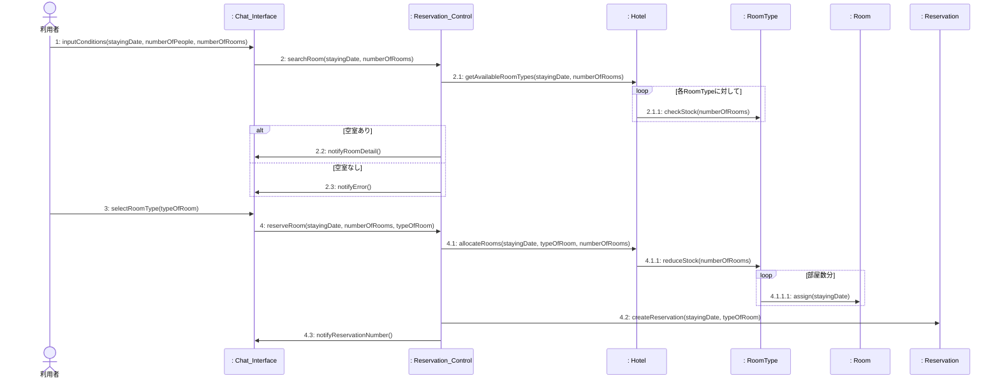
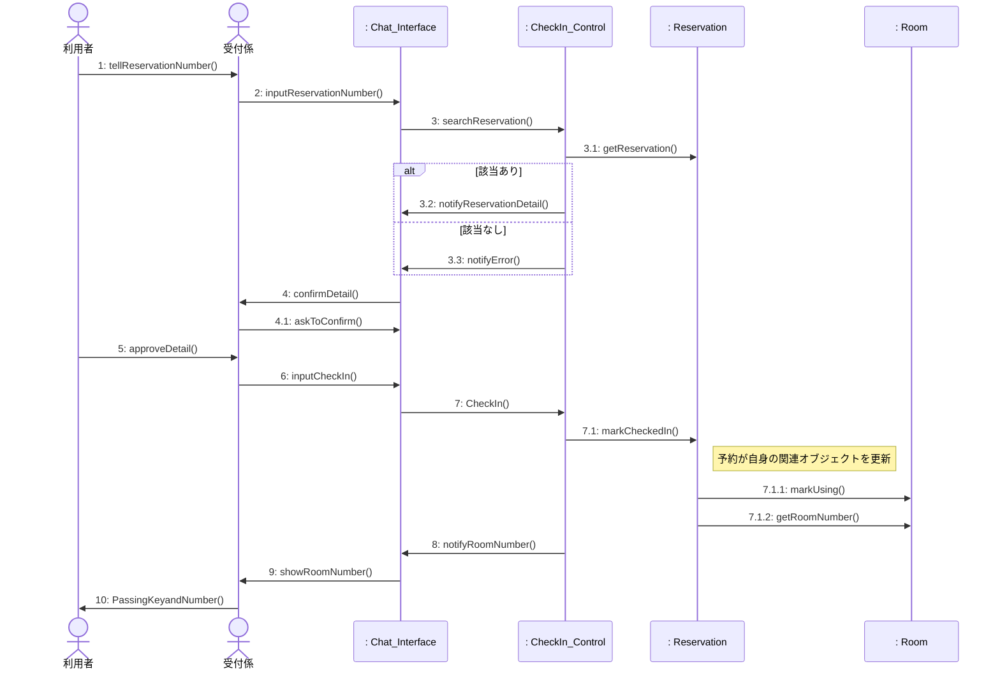
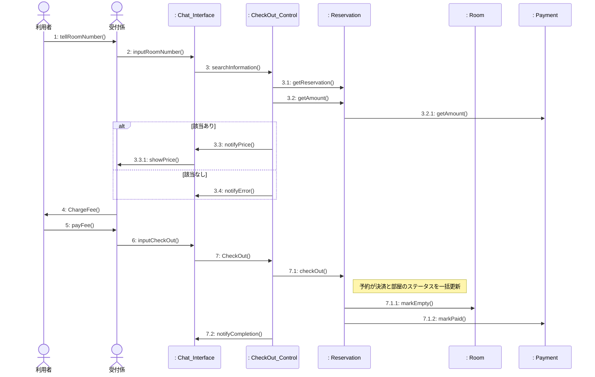
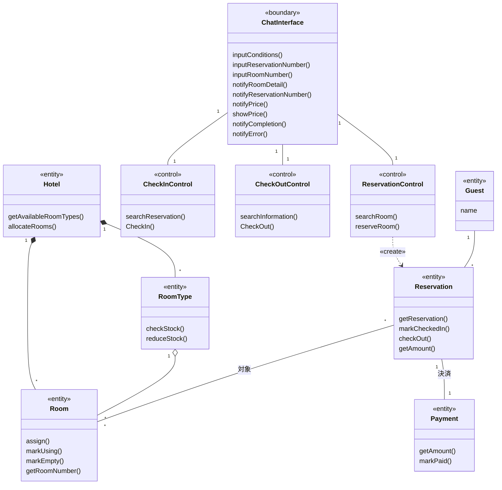

# システム分析

ホテル予約システム (HRS) のシステム分析の成果物をまとめた。本システムは, LINE Messaging API を用いて, ホテルの予約・チェックイン・チェックアウトを行うチャットボット型システムである。

システム分析では, 概念モデルと要求モデルをもとに, ロバストネス分析によって各ユースケースを実現するオブジェクトの相互作用 (コミュニケーション図) を明らかにし, それらを束ねて分析レベル・クラス図を作成する。

 

## 方針 (本分析での決定事項)

- バウンダリは, 全ユースケースで共通の1つ `ChatInterface` とする。チャットボット (単一の LINE チャット) という実態に即するためである。
- LINE Messaging API は, バウンダリ `ChatInterface` に内包し, 分析レベルの図には明示しない。LINE 連携の詳細は設計レベルで具体化する。
- コントロールは, ユースケースごとに1つずつ設ける (`ReservationControl`, `CheckInControl`, `CheckOutControl`)。
- クラス名は概念モデル (Domain_Model) に合わせて英語表記とする。操作名・メッセージ名も英語で統一し, Python 実装との対応を取りやすくする。
- **予約の対象は複数部屋を許容し、決済は予約単位で一括して行う。オブジェクト間の処理の委譲（カプセル化）を徹底する。**

 

## ロバストネス分析: 3種のクラスの特定

| 種別 | クラス | 役割 |
| --- | --- | --- |
| バウンダリ | ChatInterface | 利用者・受付係とシステムの境界。入力を受け付け、表示・通知を行う。 |
| コントロール | ReservationControl | 「部屋を予約する」の制御。ホテル・部屋タイプへの空室照会、予約の生成を行う。 |
| コントロール | CheckInControl | 「チェックインする」の制御。予約オブジェクトに対してチェックイン処理を委譲する。 |
| コントロール | CheckOutControl | 「チェックアウトする」の制御。予約オブジェクトに対して決済・チェックアウト処理を委譲する。 |
| エンティティ | Hotel | ホテル全体の管理窓口。検索や割り当ての依頼を各部屋タイプへ振り分ける。 |
| エンティティ | RoomType | 部屋タイプ。在庫数の確認や減少を行い、具体的な部屋のステータス変更を指示する。 |
| エンティティ | Room | 具体的な部屋。部屋番号や利用ステータスを管理する。 |
| エンティティ | Reservation | 予約情報。チェックイン/アウト時に、紐づく部屋や決済状態を一元的に更新する。 |
| エンティティ | Payment | 決済情報。予約に1対1で紐づき、一括決済の金額や状態を管理する。 |

 

---

## コミュニケーション図（シーケンス図による代替表現）

各図は, 1つのユースケースを実現するオブジェクト間の相互作用を表す。
情報エキスパートの原則に基づき、コントロールが直接エンティティを操作するのではなく、適切なエンティティへ処理を委譲する設計としている。

### CD1. 部屋を予約する

補足: コントローラは Hotel に空室確認と部屋の確保を依頼する。Hotel は RoomType に処理を委譲し、RoomType は自身の在庫を減らしつつ、具体的な Room のステータスを更新する (4.1.1.1)。その後、コントローラが予約オブジェクトを生成する (4.2)。

### CD2. チェックインする

補足: 受付係を介したフロント業務の流れを再現している。チェックイン確定時 (7), コントロールは Reservation に処理を委譲し、Reservation 自身が紐づく Room に対してステータス更新 (7.1.1) と部屋番号の取得 (7.1.2) を行う。

### CD3. チェックアウトする

補足: 複数部屋の一括精算に対応するため、料金照会 (3.2) およびチェックアウト処理 (7.1) はすべて Reservation に対して指示される。Reservation は紐づく Payment から料金を取得し、完了時は Room の空室化と Payment の決済済化を連動して行う。

### 分析レベル・クラス図

注記: 生成（«create»）以外の操作呼び出しによる一時的な依存関係は、図の煩雑化を防ぐため省略している。各クラスのメソッドは、コミュニケーション図においてそのオブジェクトが「受信」したメッセージを基に導出している。