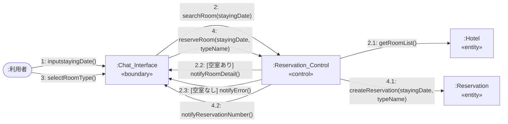
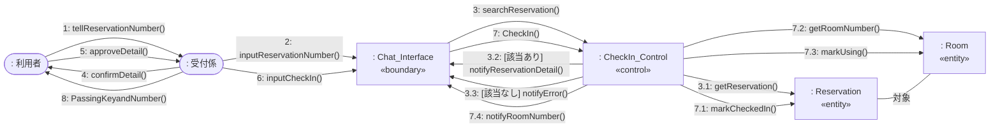
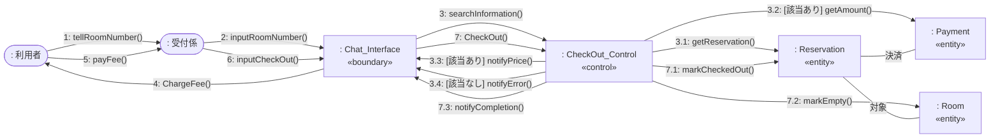
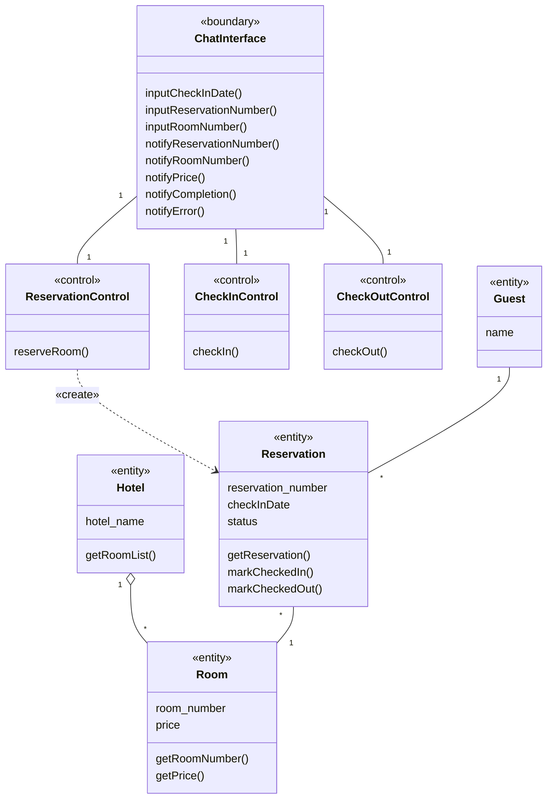

# システム分析

ホテル予約システム (HRS) のシステム分析の成果物をまとめた。本システムは, LINE Messaging API を用いて, ホテルの予約・チェックイン・チェックアウトを行うチャットボット型システムである。

システム分析では, 概念モデルと要求モデルをもとに, ロバストネス分析によって各ユースケースを実現するオブジェクトの相互作用 (コミュニケーション図) を明らかにし, それらを束ねて分析レベル・クラス図を作成する。

 

## 方針 (本分析での決定事項)

- バウンダリは, 全ユースケースで共通の1つ `ChatInterface` とする。チャットボット (単一の LINE チャット) という実態に即するためである。
- LINE Messaging API は, バウンダリ `ChatInterface` に内包し, 分析レベルの図には明示しない。LINE 連携の詳細は設計レベルで具体化する。
- コントロールは, ユースケースごとに1つずつ設ける (`ReservationControl`, `CheckInControl`, `CheckOutControl`)。いずれもユースケース当たり5個以内である。
- クラス名は概念モデル (Domain_Model) に合わせて英語表記とする。操作名・メッセージ名も英語で統一し, Python 実装との対応を取りやすくする。

 

## ロバストネス分析: 3種のクラスの特定

| 種別 | クラス | 役割 |
| --- | --- | --- |
| バウンダリ | ChatInterface | 利用者とシステムの境界。LINE を介した入力の受け取りと, 利用者への通知を担う。 |
| コントロール | ReservationControl | 「部屋を予約する」の制御。空室の割り当てと予約の生成を行う。 |
| コントロール | CheckInControl | 「チェックインする」の制御。予約の確認, 状態更新, 部屋番号の取得を行う。 |
| コントロール | CheckOutControl | 「チェックアウトする」の制御。予約の特定, 宿泊料の取得, 状態更新を行う。 |
| エンティティ | Guest | 予約を行う客 (概念モデル由来)。 |
| エンティティ | Reservation | 予約 (概念モデル由来)。本分析で状態 `status` を追加する (後述)。 |
| エンティティ | Room | 部屋 (概念モデル由来)。 |
| エンティティ | Hotel | ホテル。部屋一覧を提供する (概念モデル由来)。 |

 

---

## コミュニケーション図

各図は, 1つのユースケースを実現するオブジェクト間の相互作用を表す。メッセージ番号は起動関係を表す (例: 2 の内部で 2.1 が起動する)。

### CD1. 部屋を予約する

補足: `ReservationControl` は, Hotel から部屋一覧を取得し (2.1), 指定日の既存予約を参照して，予約可能な部屋の種類から選択を促す(2.2)。空室がない場合は, バウンダリが `notifyError()` で予約できない旨を通知し, 再度宿泊日の入力を促す (2.3)。その後，選ばれた部屋の種類と指定日の情報から新規予約を作成し (4.1)，予約番号を表示する(4.2)。なお, 予約の集合を保持・検索する仕組み (予約保管庫など) は設計レベルで具体化する。

### CD2. チェックインする

補足: 予約番号に対応する予約を取得し (3.1), その内容の確認を行う。その後，内容の確認が完了したらチェックインを行い，該当予約をチェックイン完了とし(7.1)，部屋のステータスを利用中に変更して (7.3)，鍵と部屋番号を利用者に引き渡す(8)。該当予約がない場合は `notifyError()` を通知し, 再度予約番号の入力を促す (3.3)。

### CD3. チェックアウトする

補足: 部屋番号からチェックイン済みの予約を特定し (3.1), 対象部屋の宿泊料を取得してする (3.2) 。支払いの後, 予約をチェックアウト済み状態に更新し (7.1),部屋のステータスを空室にして (7.2)，完了を通知する。該当予約がない場合は `notifyError()` を通知し, 再度部屋番号の入力を促す (3.4)。

 

---

## 分析レベル・クラス図

生成 (`«create»`) 以外の一時的な依存関係 (コントロールからエンティティの呼び出しなど) は, 図が煩雑になるため省略する (講義のシステム分析の方針による)。

注記: `status` は, 予約のライフサイクル (予約済 → チェックイン済 → チェックアウト済) を表す状態属性である。設計レベルでは, この状態遷移を UML ステートマシン図として設計する予定である。

### 操作の導出について

各操作は, コミュニケーション図でメッセージを受け取るクラスに, 同名の操作として持たせている。オブジェクト生成に関する操作 (`new Reservation(...)`) は, 操作ではなく `«create»` 依存として表すため, クラスの操作には含めていない。

 

---

## ドメインモデル・要求モデルへの修正提案

システム分析の過程で, 次の修正を提案する。

1. **Reservation に状態 `status` を追加する。** 値は `reserved` (予約済), `checkedIn` (チェックイン済), `checkedOut` (チェックアウト済) とする。
   - 理由: 「チェックインする」「チェックアウトする」の事前条件・事後条件 (チェックイン済みであること等) を表現・検証するために必要である。
   - 反映先: Domain_Model.md の Reservation クラスに `status` を追加するとよい。
2. **予約の検索・保持の仕組み。** 予約番号や部屋番号による予約の検索が必要となる。分析レベルでは Reservation への操作として表したが, 予約集合を保持・検索する仕組み (予約保管庫) は設計レベルで導入する。

 

## 今後の検討事項

- 宿泊料の支払い方法 (チャット上での決済か, 現地払いか)。決済を含める場合, チェックアウトの相互作用に支払い処理を追加する。
- 予約集合を保持・検索する仕組み (予約保管庫) の設計。
- 同一部屋・同一宿泊日の予約は高々1つという制約を, どのクラスの責務で保証するか (現案では ReservationControl の予約生成時に判定)。
