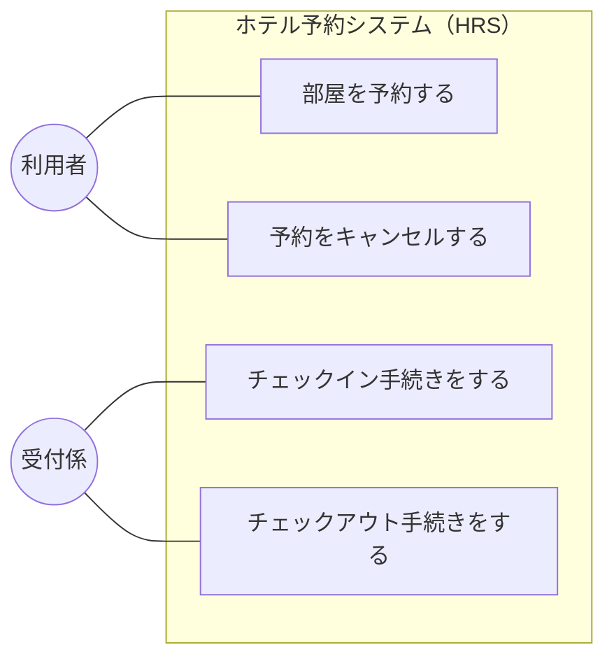
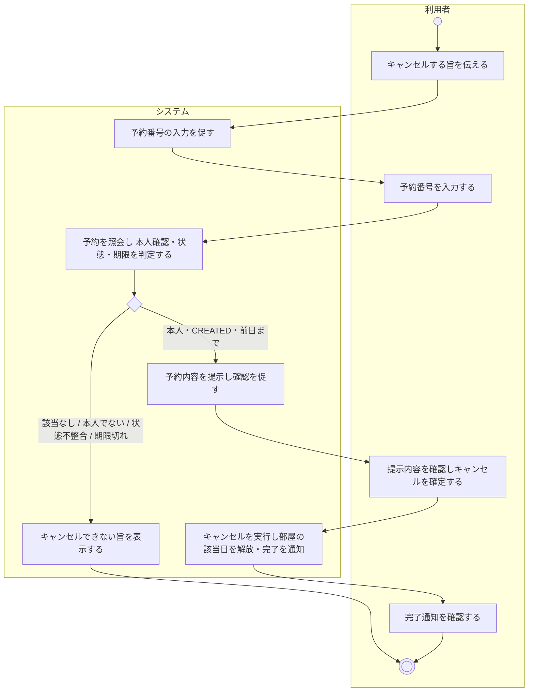
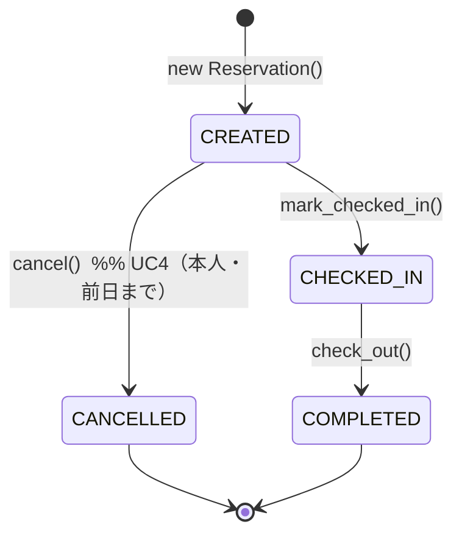
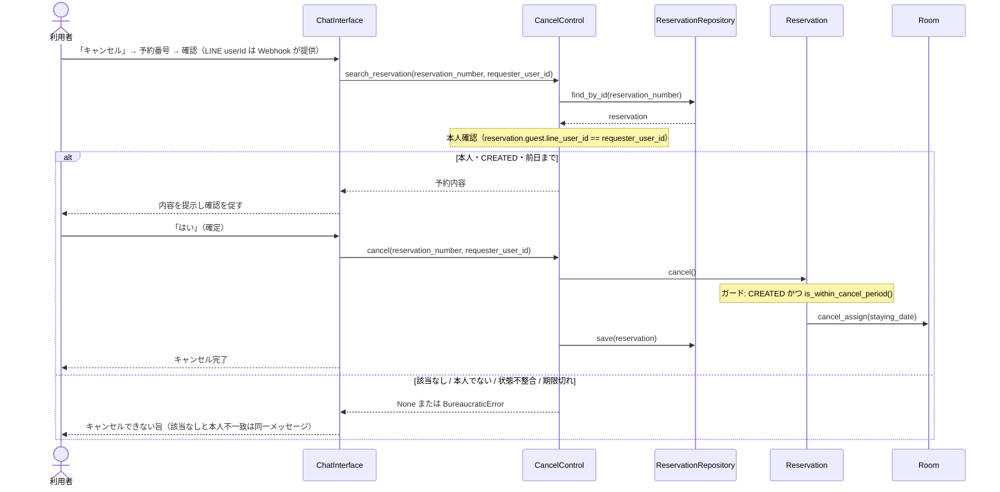

# 予約キャンセル機能（UC4）

予約キャンセル機能に関する記述を、この1ファイルに集約する。ユースケース・フロー・設計・実装・残課題をまとめる。実装は完了済みである。

- 検討の経緯・合意形成の記録は [Cancel_Feature_Proposal.md](Cancel_Feature_Proposal.md)（提案書）を参照。
- 他の設計成果物（[Requirements_Analysis.md](Requirements_Analysis.md) / [System_Analysis.md](System_Analysis.md) / [Architecture.md](Architecture.md) / [Design.md](Design.md)）には UC4 の詳細を重複記載せず、本ファイルに一本化する。

---

## 1. 概要

- **利用者が LINE で、未チェックインかつ宿泊日の前日までの、自分の予約をセルフキャンセルする。**
- **本人確認**: 予約時に予約者の LINE userId を保存し、キャンセルは要求者の userId が一致する場合のみ許可する。
- **在庫**: キャンセルにより、確保していた部屋・宿泊日が解放され、再度予約可能になる（DB引きで自動反映）。

---

## 2. ユースケース図

既存の UC1〜UC3 に UC4 を加える。

---

## 3. ユースケース記述

| 項目 | 内容 |
| --- | --- |
| ユースケース | 予約をキャンセルする |
| アクタ | 利用者 (予約者本人) |
| 目的 | 利用者が, チェックイン前日までに, 自分の予約を取り消す |
| 事前条件 | 対象の予約が存在し, ステータスが「予約済み (CREATED)」であり, 要求者が予約者本人 (LINEで予約した本人) であり, 本日が宿泊日の前日以前である |
| 事後条件 | 予約のステータスが「キャンセル済み (CANCELLED)」に更新され, 確保していた部屋・宿泊日が解放されている |

**基本系列**

1. 利用者は, LINE でシステムに予約をキャンセルする旨を伝える。
2. システムは, 予約番号の入力を促す。
3. 利用者は, 予約番号を入力する。
4. システムは, 予約が要求者本人のものであることを確認し, 予約内容 (宿泊日・部屋・料金) を提示して確認を促す。
5. 利用者は, キャンセルを確定する。
6. システムは, 予約をキャンセル済みに更新し, 確保していた部屋の該当日を解放する。
7. システムは, キャンセル完了を利用者に通知する。

**代替系列**

- 基本系列4: 該当する予約がない, または要求者本人の予約でない場合は, 予約の存在を第三者に推測させないため, 共通の「見つからない」メッセージで終了する。
- 基本系列4: 予約がチェックイン済み・完了済み・キャンセル済みの場合は, キャンセルできない旨を表示して終了する。
- 基本系列4: 本日が宿泊日当日以降の場合は, キャンセル期限を過ぎている旨を表示して終了する。
- 基本系列5: 利用者が確定しなかった場合は, キャンセルを行わずに終了する。

**備考**

- キャンセルは宿泊日 (チェックイン) の前日まで行える。
- 本人確認は LINE の userId 一致で行うため, キャンセルできるのは LINE で予約した本人に限る。

---

## 4. アクティビティ図

---

## 5. 状態遷移

キャンセルは既存のステートマシンの `CREATED → CANCELLED` に対応する（新たな状態は追加しない）。

- キャンセル可能: `status == CREATED` かつ `本日 < 宿泊日`（前日まで, `Reservation.is_within_cancel_period()`）かつ 要求者が本人。
- キャンセル不可: `CHECKED_IN` / `COMPLETED` / `CANCELLED`, または期限切れ, または本人でない → `BureaucraticError`（本人でない・該当なしは同一の応答）。

---

## 6. シーケンス図（相互作用）

本人確認 (userId 照合) はコントロールが, 状態・期限のガードはドメインが担う。

---

## 7. 設計と責務

| 要素 | 役割 |
| --- | --- |
| `Guest.line_user_id` | 予約を行った LINE 利用者の識別子。予約時に保存する。 |
| `Reservation.cancel()` | 状態 (CREATED) と期限 (前日まで) を検査し, 紐づく `Room` の該当日を `cancel_assign()` で解放して `CANCELLED` にする。 |
| `Reservation.is_within_cancel_period()` | キャンセル可能期間 (`本日 < 宿泊日`) の判定。期限ルールをここに集約。 |
| `CancelControl.search_reservation(number, requester_user_id)` | 本人の予約のみ返す。本人でない予約は `None`（該当なしと区別しない）。 |
| `CancelControl.cancel(number, requester_user_id)` | 本人確認のうえキャンセルを予約へ委譲。`requester_user_id` は必須引数。 |
| `SessionManager` (`CANCEL_AWAITING_RES_NUM` / `CANCEL_AWAITING_CONFIRM`) | LINE のキャンセル対話の進行状態。 |
| `ChatInterface` | 「キャンセル」/「予約キャンセル」で開始 → 予約番号 → 本人確認つき照会 → 確認 → 確定。 |

### 本人確認が成立する根拠

LINE の Webhook イベントには送信者の `userId` (`event.source.user_id`) が含まれ, `X-Line-Signature` の署名検証を通っているため詐称できない。予約者の userId と要求者の userId を突き合わせることで, 予約者本人のみがキャンセルできることを保証する。

---

## 8. 実装とテスト

- 実装: `.code/domain/models.py`（`Guest.line_user_id` / `Reservation.cancel` / `is_within_cancel_period`）, `.code/application/cancel_control.py`, `.code/application/reservation_control.py`（`line_user_id` 保存）, `.code/infrastructure/sqlite_reservation_repository.py`（`guest_line_user_id` 列・マイグレーション）, `.code/ui/session_manager.py`, `.code/ui/chat_interface.py`。
- テスト: `.code/scripts/tests/test_cancel_control.py`（本人確認・状態/期限・情報秘匿）, `.code/scripts/tests/test_chat_interface.py`（LINE キャンセル対話）, `.code/scripts/tests/test_domain_models.py`（期限ガード）, `.code/scripts/tests/test_sqlite_repository.py`（既存 DB のマイグレーション）。

---

## 9. 残課題

- **No-show（無断不泊）の処理導線**: チェックインは宿泊日当日のみ, キャンセルは前日までのため, 当日・過去の未チェックイン予約 (CREATED) を片付ける手段が現状ない。将来の受付係向けキャンセル導線（同じ `CancelControl` を再利用）で対応する。
- **キャンセル料・返金**: 無料キャンセル前提。ポリシーを設ける場合は `Payment` の状態遷移とともに設計する。
- **予約内容の変更**（日付・部屋の変更）: 現状はキャンセル→再予約で対応。専用機能は未対応。
